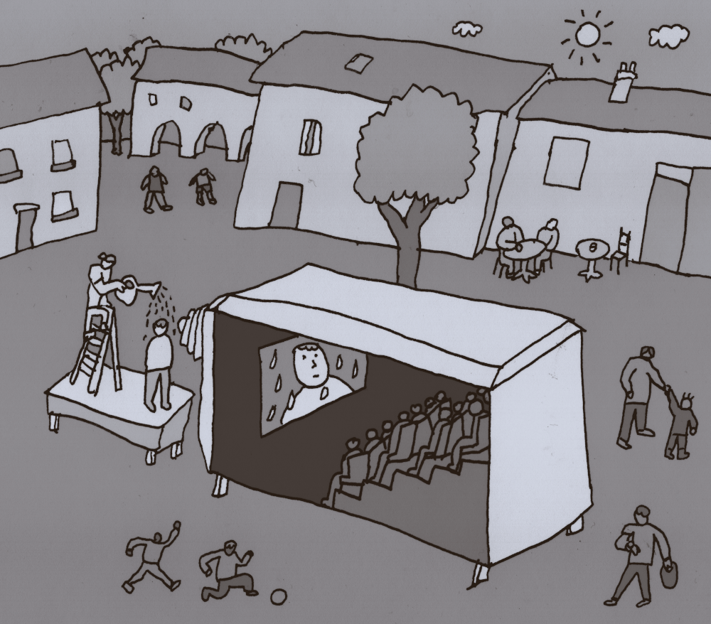

# Camera Obscura

Théâtre optique post-cinéma

### travail en cours

*Camera Obscura* est un spectacle de théâtre optique itinérant de la Cie Nokill dont la première a eu lieu le 3 aout 2024. 

Sur ce site nous avons rassemblé au fur et à mesure de la création, tous les contenus artistiques et techniques utiles. 

Même si à la base cette documentation est un outil de travail personnel, nous avons décidé de la mettre à disposition de toute personne intéressée par ce projet.

### à propos

*Camera Obscura* est un dispositif qui propose au public l'expérience unique d'une séance de cinéma sans électricité. Les spectateur·ices s'installent dans la camera obscura et assistent à la projection d’un film tourné à l'extérieur. Les images sont projetées grâce à un système optique fait de lentilles et de miroirs. Les sons et la musique sont produits et interprétés en direct sur un ensemble d’instruments acoustiques et mécaniques.

### Souvenirs du futur

Le film projeté est [*Souvenirs du futur*](contenu/ecriture/souvenirs-du-futur.md). C'est une collection de fragments, des évocations vagues ou anecdotiques de futurs possibles. Des récits d'anticipations qui s'affranchissent des thèmes de la science fiction et proposent une vision ni utopique ni apocalyptique d'un futur pluriel, banal et étrange.

### sommaire

- [Remorque](contenu/remorque.md), construction du théâtre optique "Camera Obscura".
- [Écriture](contenu/ecriture), textes, scenarios, découpages et références.
- [Objet](contenu/objet), plaques animées, marionettes, costumes, accéssoires, décors, utilisés dans le film.
- [Technique](contenu/technique), questions et réponses concernant les differents défis techniques. 
- [Prototypes](contenu/prototypes), liste des chambres construites pendant la création.
- [Production](contenu/production.md), partenaires du projet et calendrier des résidences.
- [Bibliographie](contenu/bibliographie.md), liens et documents utiles.
- [Dossier de création](contenu/dossier/dossier-camera-obscura-2024-web.pdf), télécharger le dossier en pdf.
- [Présentation du projet](contenu/presentation-partenaires.md), à l’intention des partenaires techniques et scientifiques.
- [Todo](contenu/todo.md), bloc-notes des trucs à faire.
- [Media](contenu/media.md), liste de tous les media liés à la documentation de la création.
- [Meta](contenu/meta.md), Ressources liées à l'écriture de ce site.

