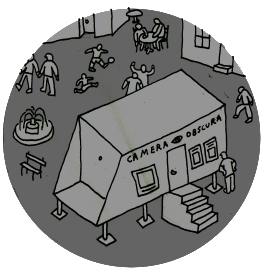

# Camera Obscura

### travail en cours

*Camera Obscura* est un projet de théâtre optique itinérant de la Cie Nokill dont la première est prévue pour l'été 2024. 

Sur ce site nous rassemblons au fur et à mesure de la création, tous les contenus artistiques et techniques qui nous sont utiles. 

Même si à la base cette documentation est un outil de travail personnel, nous avons décidé de la mettre à disposition de toute personne intéressée par ce projet.

### à propos

Camera Obscura est un spectacle de rue qui plonge le spectateur dans un dispositif cinématographique ancestral, sans pellicule, ni vidéo, ni électricité, et qui n’utilise comme énergie que celle du soleil et des comédiens. Le public s’installe dans un lieu fermé, une chambre noire, et assiste à la projection d’un film dont les images sont des captations du monde extérieur qui transitent par un dispositif optique fait d’objectifs, de prismes et de miroirs.

Dans la chambre noire, les voix, les sons et la musique sont produits et interprétés en direct sur un ensemble d’instruments acoustiques et mécaniques : gramophones, automates sonores, cymbalum et accessoires de bruitages. Ces ondes sont traitées par des dispositifs acoustiques, membranes, tuyaux, pavillons, qui donnent l’illusion d’une bande pré-enregistrée diffusée à travers des hauts-parleurs.

Immergé dans cette proposition, le spectateur vit une expérience sensorielle unique composée de sons bruts et d’images hyper définies qui lui suggèrent de réinterpréter le monde qui l’entoure. La transformation du réel, de ce qui se passe à l’extérieur de la chambre noire est renforcée par le choix du cadre et l’interprétation, la mise en fiction qui en est faite par les comédiens. 

### sommaire

- [Prototypes](contenu/prototypes), liste des chambres construites pendant la création.
- [Remorque](contenu/remorque.md), construction du théâtre optique "Camera Obscura".
- [Écriture](contenu/ecriture), textes, scenarios, découpages et références.
- [Technique](contenu/technique), questions et réponses concernant les differents défis techniques. 
- [Production](contenu/production.md), partenaires du projet et calendrier des résidences.
- [Bibliographie](contenu/bibliographie.md), liens et documents utiles.
- [Dossier de création](contenu/dossier/dossier-camera-obscura-2024-web.pdf), télécharger le dossier en pdf.
- [Présentation du projet](contenu/presentation-partenaires.md), à l’intention des partenaires techniques et scientifiques.
- [Todo](contenu/todo.md), bloc-notes des trucs à faire.
- [Media](contenu/media.md), liste de tous les media liés à la documentation de la création.

