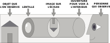

# Atelier Camera Obscura

La Cie Nokill propose un atelier autour du spectacle *Camera Obscura* animé par deux de ses comédien·nes.

## En Pratique

* Nombre de Participant·es : 15 personnes ou 30 personnes avec un·e encadrant·e.
* Public : adultes et enfants à partir de 8 ans.
* Durée : entre 2 et 3 heures.
* Nombre d'intervenant·es : 2
* Matériel à fournir : Une paire de ciseaux par personne.
* Coût de l'atelier : Le devis peut être demandé par mail à cie@nokill.fr il comprend les salaires des intervenant·es et le prix du matériel fourni par la compagnie.

## Présentation

Cet atelier est une introduction au principe optique de la camera obscura qui malgré quelques élements théorique se concentre plus sur l'expérimentation pure a travers l'expérience de differentes camera obscura et la fabrication d'une camera originale par participant·e.

## Objectifs

* Découvrir le principe de la camera obscura, un phénomène naturel utilisé jusque dans nos téléphones portables et se le réapproprier à travers une démarche low-tech. 
* Se construire une camera par personne en conciliant rigueur pour la réalisation technique et créativité pour la décoration.
* Repartir de l'atelier avec une camera obscura par personne.

## Déroulé

* Présentation rapide du spectacle (~10 min)
* Explication rapide du concept de camera obscura (~10 min) : Sans trop entrer dans les détails techniques, on explique en quoi consiste le principe de la camera obscura, son histoire et ses applications dans la vie de tous les jours.
* Démonstration (~20 min) : Un prototype amené par la compagnie est montré aux participant·es. Si l'espace le permet on peut aussi tenter l'expérience de transformer la salle dans la quelle se déroule l'atelier en une camera obscura géante !
* Fabrication (~60 min) : Chaque participant·e se lance dans la fabrication de sa camera en suivant les consignes données par les intervenant·es.
* Décoration (~30 min) : À l'aide de ciseaux de papier et de colle : chaque participant·e décore sa camera de manière libre.
* Exploration (~30 min) : Le groupe sort à l'extérieur pour regarder le monde à travers sa camera.

## Les camera fabriquées

Les cameras sont conçues à partir d'une boite ou d'un tube un carton. D'un côté de la camera : une lentille (fournie par la compagnie). À l'intérieur un écran (en papier calque) sur lequel l'image de l'extérieur apparaît à l'envers. Sur les parois, on colle du papier découpé pour personnaliser la camera. L'objet obtenue mesure une trentaine de centimètres de long.

## En amont des ateliers et du spectacle

Si vous souhaitez préparer l'atelier ou le spectacle en amont (facultatif) voici quelques pistes :

* Le fanzine : https://camera-obscura.cienokill.fr/contenu/dossier/leprincipedelacameraobscura.pdf
* Le site du spectacle : https://camera-obscura.cienokill.fr/
