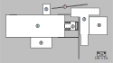

# Camera Obscura

## Notice technique du fabricant

<!--
__TODO: Vérifier que ce document contient :__  

- Description détaillée  
- Plan des installations techniques
- Description des parties de l'ensemble
- Nomenclature des pièces avec schémas
- Codification du marquage des pièces

-->

### Préambule

Ce document est fourni par NOKILL en tant que fabricant de CAMERA OBSCURA conformément à l'Arrêté du 25 juillet 2022 fixant les règles de sécurité et les dispositions techniques applicables aux structures provisoires et démontables.

### Fabricant

CAMERA OBSCURA a été fabriquée en 2025 par la Cie NOKILL

SARL NOKILL  
Siège social : NOKILL — 6 rue du Dr Bastié — 81300 Graulhet  
SIRET :	39102418900055  
RSC : CASTRES 391 024 189  
Licence spectacle :	PLATESV-R-2022-004670 – Catégorie 2

### Description du système

L'ensemble CAMERA OBSCURA est une salle de spectacle itinérante conçu par la Cie NOKILL pour diffuser un spectacle utilisant le principe optique de la chambre noire.

### Description de l'ensemble

L'ensemble se compose :

- d'une REMORQUE (1), espace clos pouvant accueillir 25 personnes.
- d'une STRUCTURE SCÉNIQUE (2), démontable fixée à l'extérieur de la REMORQUE.
- d'une STRUCTURE OPTIQUE (3), démontable fixée à l'extérieur de la REMORQUE.
- d'un ESCALIER PRINCIPAL (4), démontable fixé à l'extérieur de la remorque devant une des deux portes.
- d'un ESCALIER DE SECOURS (5), démontable fixé à l'extérieur de la remorque devant l'autre porte.
- d'un REFLECTEUR (6), mobile sur roulettes.
- d'un PORTIQUE (7), permettant de suspendre des feuilles de décors.

Le schéma ci-dessous montre le placement de ces éléments :

<!--

### Nomenclature des pièces avec schémas

__TODO: Détailler la nomenclature des pièces__

### Codification du marquage des pièces

__TODO: Décider d'une codification__
-->

### Dimensions extérieures des parties

L'ensemble une fois monté occupe une surface de 13 × 8 mètres.

Le tableau ci-dessous détaille la dimension en mètres de chaque partie de l'ensemble une fois monté.

| N | partie | largeur | longueur | hauteur |
| 1 | REMORQUE | 2,5 | 7,6 * | 3,10 |
| 2 | STRUCTURE SCÉNIQUE | 5,7 | 4,6 | 3 |
| 3 | STRUCTURE OPTIQUE | 1 | 1,5 | 2,5 |
| 4 | ESCALIER PRINCIPAL | 2,4 | 1,3 | 0,6 |
| 5 | ESCALIER DE SECOURS | 0,8 | 1,2 | 0,6 |
| 6 | REFLECTEUR | 2 | 2 | 3 |
| 7 | PORTIQUE | 4 |   | 3 |

\* Compte tenu de la flèche et de la casquette arrière

### Dimensions de l'intérieur et des accès public

Le schéma ci-dessous détaille les dimensions de l'intérieur et des accès public en centimètres.

### Différentes configurations possibles pour l'accès public

En fonction de l'espace ou la structure est implantée, l'ESCALIER PRINCIPAL et l'ESCALIER DE SECOURS peuvent être placés d'un côté ou de l'autre de la remorque. Le schéma ci-dessous montre les deux possibilités :

**Escalier principal "à l'est" :**

**Escalier principal "à l'ouest" :**

Une rampe de 4 m (pente de 15 %) peut être montée temporairement sur un des deux accès pour les séances où des personnes avec fauteuil sont accueillies.

### Aménagements intérieurs

En cas d'accueil de personnes à mobilité réduite (PMR) il est possible de retirer une ou deux paires de sièges au premier rang pour créer une ou deux place PMR.

- Configuration A : quand tous les sièges sont montés la jauge est de 21.
- Configuration B : en enlevant deux sièges on peut accueillir une PMR (jauge totale : 20)
- Configuration C : en enlevant quatre sièges ont peut accueillir deux PMR (jauge totale : 19)

Le schéma ci-dessous montre le gradin avec tous les sièges montés (Configuration A) :

Le schéma ci-dessous montre comment deux places PMR sont créges en enlevant les quatre fauteuils du premier rang (Configuration C) :

### Limites d'utilisation

L'utilisation de l'ensemble doit tenir compte des limitations suivantes pendant les phases de montage, d'exploitation et de démontage :

- Vitesse de vent maximum : 72 km/h
- Charge maximum à l'intérieur de la remorque : 30 personnes / 2,5 tonnes

### Spécifications de maintenances

L'usure des différentes pièces doit être vérifiée à chaque montage. Les pièces défectueuses doivent être remplacées ou réparées avant toute utilisation.

### Notice de montage

##### Préconisations relatives aux appuis au sol

Lors du montage, vérifier :

- la bonne horizontalité de la REMORQUE par le réglage des béquilles.
- la bonne horizontalité de la STRUCTURE SCÉNIQUE et de la STRUCTURE optique par le réglage des socles réglables à vis.
- l'utilisation de cales sous les appuis de la REMORQUE et de la STRUCTURE SCÉNIQUE si l'ensemble est implanté sur un sol meuble.

##### Les modes de préhension et d'élingage

L'assemblage des éléments se fait principalement avec des colliers clamps serrage à papillon et des raccords tubulaires serrage à vis.

Lors du montage, vérifier :

- le bon serrage des colliers et raccords tubulaires.
- l'utilisation d'élingues si du matériel est suspendu à la structure.

##### Procédure de montage et de démontage en sécurité

Personnel pour le montage et le démontage : 2 personnes minimum.

Lors du montage et du démontage, vérifier :
- Que les équipements de sécurité adaptés sont utilisés.
- Quel l'outillage adapté est utilisé.
- L'absence du public sur le lieu du montage.

Effectuer le montage dans cet ordre :

1. Placement de la remorque
2. Calage de la remorque
3. Montage des plateformes et des escaliers
4. Montage du reste de la structure

