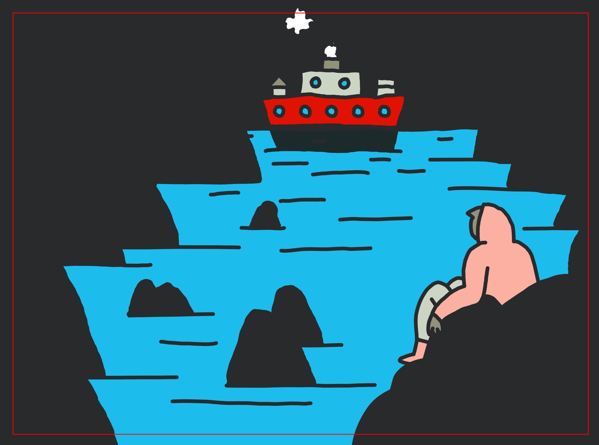
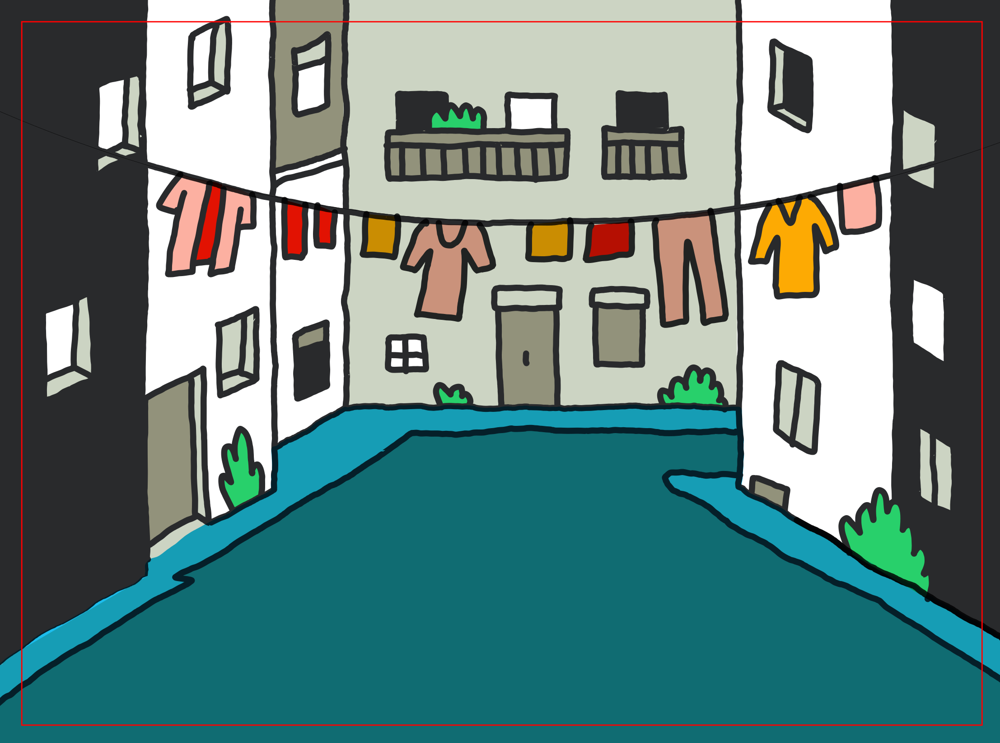
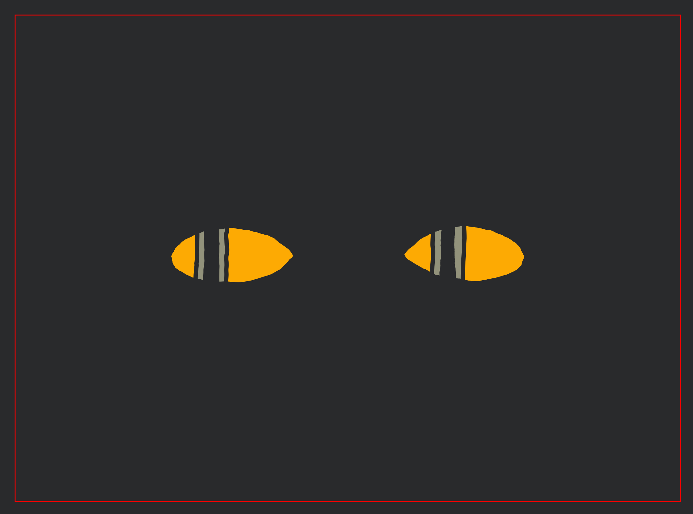
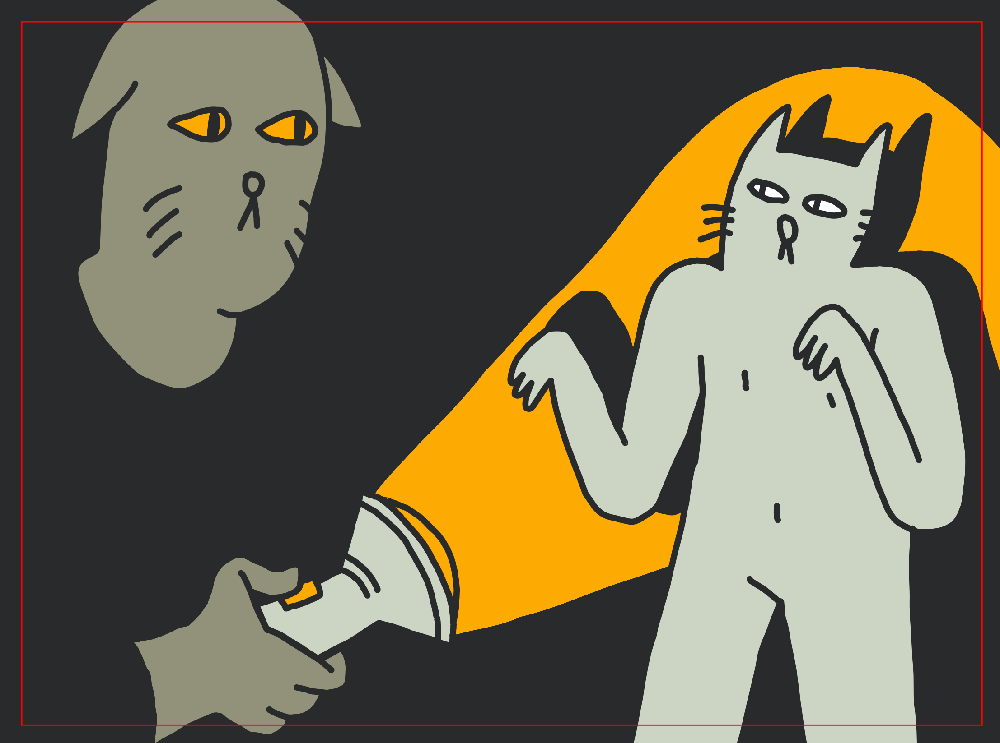
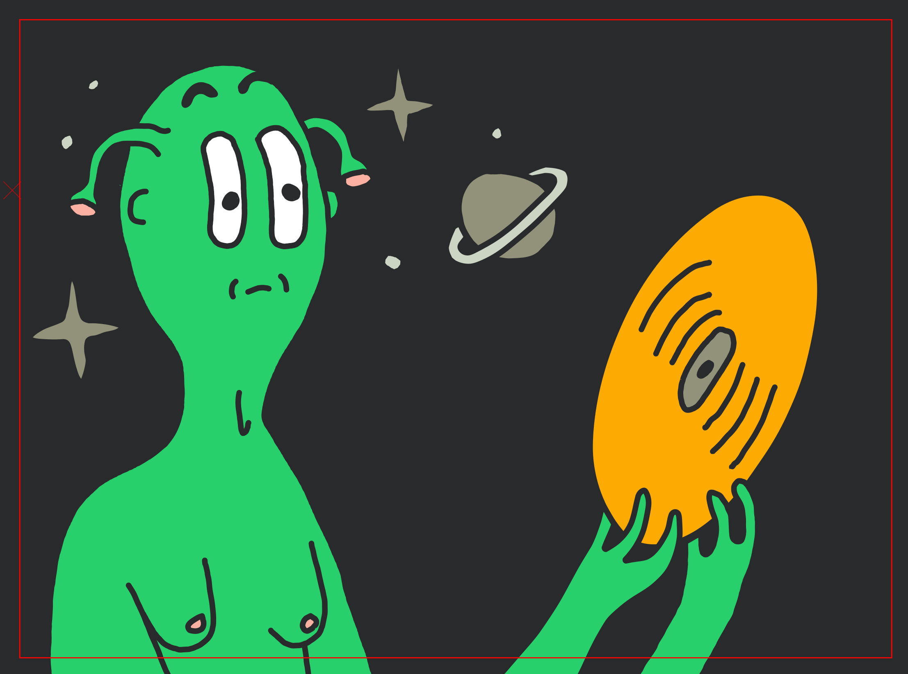
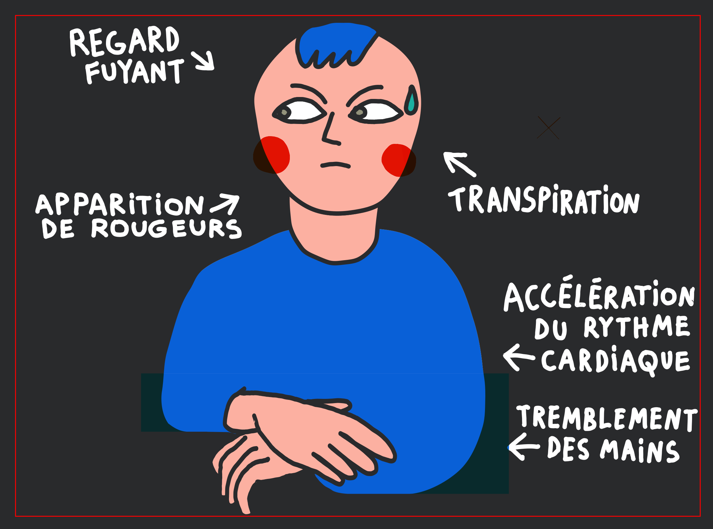
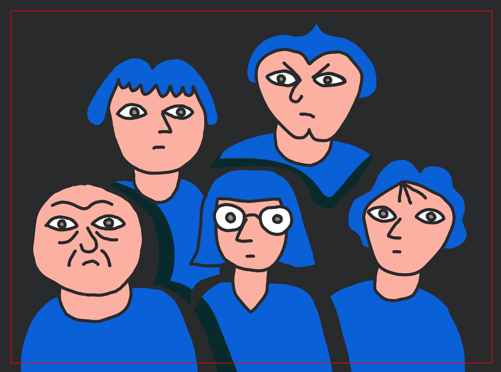
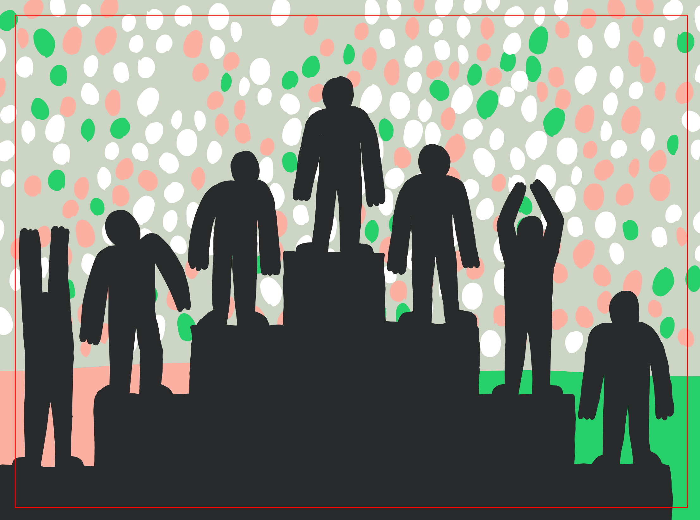

# Plaques et marionnettes

Les titres, les séquences animés et les séquences photos fonctionnent grâce à un système de plaques et de marionnettes retro-éclairées.

Les plaques sont en plexiglas, elles mesurent environ 800 × 600.

## Éclairage, mise et accrochage des plaques

Les plaques sont équipées de crochets avec des roulettes. Elles sont suspendues sur un rail sur le quel elles peuvent rouler latéralement pour enchaîner rapidement deux plaques. Le rail mesure 2800 de long.


À l'arrière des plaques il faut un blanc très lumineux pour compenser la luminosité très faible de la lentille que l'on utilise pour les filmer (c'est le plus gros plan avec un grandissement d'environ ×2,5 donc très sombre !)

Notre idée est d'avoir deux systèmes à notre disposition :
- En cas de ciel dégagé, un grand écran blanc reflète la lumière du soleil. (matériau : ultrabounce ??)
- En cas de ciel nuageux, un grand miroir reflète le blanc des nuages. (matériau : miroir souple ? mirolege ? Soft Silver ?)


Les réflecteurs doivent faire environ 1500×2000. ([calcul de ces mesures](../plans/plaques-reflecteurs.pdf))


## Dessin et vinyle

Les plaques des animations sont faites avec du vinyle autocollant découpé au cutter numérique. (Voir [ce tuto](https://www.youtube.com/watch?v=6oG9WtHLb-w) pour l'application)

Épaisseur de trait : 4.8 mm

Couleurs : On se limite à une palette de couleurs restreinte : du noir (opaque) et un jeu de couleurs clairs transparente. Les zones laissées transparentes (sans vinyle) apparaissent blanche.

Dessin : Les dessins sont faits sur Inkscape dans (source: [animations/animations.svg](../animations/animations.svg))

### Nuancier


- [ORACAL 8300](https://www.orafol.com/fr/europe/produits/oracal-8300-transparent-cal) (transparent)
  - Bleu roi #049
  - Bleu clair #053
  - Vert #061
  - Jaune or #020
  - Rose saumon #089
  - Rouge clair #031
  - Gris moyen #074
  - Gris foncé #073
- [ORACAL 641](https://www.orafol.com/fr/europe/produits/oracal-641-intermediate-cal) (opaque mat)
  - noir #070

## Mécanisme des animations et plexi

On utilise du plexiglas transparent GS.

Le GS (moulé) est plus cher mais plus rigide, se découpe mieux, meilleure finition que le XT (extrudé).

Les pièces de plexi non-rectangulaires seront découpées à la découpeuse laser.

Les mécanismes de translation sont fait avec des guides en plexi (droits ou courbes).

Chaque guide est construit avec deux épaisseurs de plexi. du 4 mm (1 mm de jeu sur l'épaisseur) pour guider. Et du 3 mm pour piéger la plaque.

Pour les mécanismes de rotation, on met aussi des guides (courbes) et si l'axe de rotation est dans la plaque, on met un boulon de classeur de 4 mm Ø dans un trou de 5 mm Ø

Les arrêtes des plaques peuvent être biseautés pour éviter d'abîmer le vinyle lorsqu'une plaque glisse sur une autre.
 
## Dimensions

Pour le rangement, l'idée est qu'aucune plaque ne dépasse 800×800 mm

Si une plaque devait être plus grande elle devra être démontable.

- Encombrement max : 800×800
- Plaque fixe :  800×650
- Fond perdu : 20
- Marge droite/gauche : 5
- Marge haut/bas : 30
- Image :  790×590
- Image utile :  750×550


- "Demi-plaques" chez plexiglas : 2050×1520

## Les plaques

Il y a un peu plus d'une vingtaine de plaques. 

Certaines sont animées (méchanismes de rotation ou de translation activés par des leviers). D'autres sont fixes (décors pour film animé ou photo).

Les plaques sont projetées en étant retro-éclairées comme des plaques de lanterne magique ou des diapositives.


## Les marionnettes

On appelle marionnette les parties mobiles des animations, qui ne sont solidaires des plaques. Ce sont des sortes de pantins articulés en 2d.


## Liste des plaques et marionettes

#### Photo *Vacances* 1

#### Photo *Vacances* 2

#### Photo *Vacances* 3

#### Photo *Mode*

#### Journal *Bon sens*


#### Titres

C'est une plaque opaque sur les bords gauche et droite et transparente au milieu (bande transparente de 500 mm). 

Deux volets permettent d'opacifier aussi 243 mm en haut et en bas.

Un rouleau souple permet de faire défiler verticalement les titres dans la partie transparente. Le rouleau peut être coincé entre deux plaques transparentes.

Pour le générique de début et les intertitres, les volets sont fermés et c'est un titre tous les 243 mm. Pour le générique de fin, on ouvre les volets et ça défile.

#### *Prologue*



Fixe : Décors mer avec un perso sur un rocher.

Anim 1 : Petite translation en allez-retours pour animer des reflets dans l'eau.

Anim 2 : Longue translation horizontale pour le déplacement du bateau. La translation fait aussi apparaître des nuages de fumée au dessus du bateau (larges rayures croisées).

#### *Niveau de l'eau*





Fixe : Décors ville en perspective cavalière.

Anim 1 : Longue translation verticale pour faire monter l'eau.

Anim 2 : Longue translation horizontale sur rail courbe pour faire sortir le linge.

Mario 1 : Personnage parapluie

Mario 2 : Une baleine (queue animée) + 3 poissons

#### *Mutation* 1




Fixe : Yeux vides

Anim : Paupières et pupilles


#### *Mutation* 2




Fixe : Deux persos + décors + caches noirs

Anim : Rotation du bras et d'un grand cache (cache tout sauf le faisceau de la lampe). Dévoile le deuxième perso.


#### *Période malheureuse*


Fixe : Décors parc d'attraction et circuit montagnes russes. (Guide pour les marios des chariots).

Mario 1 : Chariot arrière plan

Mario 2 : Chariot premier plan


#### *Golden record* 1


Fixe : La fusée et son ciel sur une bande verticale au centre. Caches pour faire clignoter les étoiles.

Anim 1 : Longue translation Le reste du ciel qui défilent.


#### *Golden record* 2




Fixe : Perso et décors

Anim : Translation verticale courte en aller-retours des avants-bras tenant le disque et des yeux.


#### *Golden record* 3


Fixe : Perso sans visage ordi et décors.

- Plaque : rect 1000×700
- Mécanique : 3 rails dont 1 avec gorge
- Couleurs : #070 #089 #053 #074 #073
- Aperçu : [aperçu plaque fixe golden record 3](../animations/goldenrecord-3-fixe.png)


Anim : Courte translation horizontale pour pouvoir changer de visage.

- Plaque : rect 760×354
- Mécanique : 1 poignée + 1 butée
- Couleurs : #070 #089
- Aperçu : [aperçu plaque anim golden record 3](../animations/goldenrecord-3-anim.png)

#### *Comportement* 1




Fixe : Transparent

Anim 1 : Translation horizontale en aller-retour pour le mouvement des yeux + volet texte A

Anim 2 : Rotation pour gouttes de transpiration + volet texte B

Anim 3  Translation horizontale courte pour rougeurs + volet texte C

Anim 4 : Translation horizontale pour volet texte D

Anim 5 : Translation horizontale courte rapide en aller-retour pour mains

Anim 6 : Translation horizontale pour volet texte E

#### *Comportement* 2




Fixe : 3 visages et 2 paires d'yeux.

Anim : Translation courte horizontale de 2 visages et 3 paires d'yeux pour faire les croisements de regards.

#### *Épilogue* 1


Fixe : Mer opaque avec zone pour laisser apparaître le perso. Reflets lune et étoiles.

Anim : Translation verticale. Fait apparaître le personnage petit à petit.

#### *Épilogue* 2


Fixe : Décors Mer

Anim 1 : Translation verticale aller-retour pour faire flotter le perso.

Anim 2 : Nuages.

#### *Période heureuse*


Fixe : Rue

Mario 1 : Une file d'attente avec 4 persos.

Détails :

Les 4 pieds gauches sont articulés sur une même came. Idem pour les 4 pieds droits.

En faisant glisser une à une les 2 cames, on fait faire un pas à tout le monde.

Chaque perso a 2 articulation pied et deux articulations anches. Les persos peuvent avoir d'autres articulations pour leur donner de la souplesse et du caractère (buste, bras, tête, etc.)

#### *Podium*



Fixe : Stade

Mario 1 : Le Podium avec plein de marches.

Mario 2 : Un perso qui grimpe les marches. Il se manipule par les pieds. (2 articulations anches, 2 articulations genoux)

Détails Mario 1 :

On peut le déplacer vers le haut pour faire pousser le podium. Il y a des cales pour l'arrêter à chaque étapes.

Les marches sont numérotés ainsi :

```
    1
   3 2
  5   4
 7     6
   etc.
```

Marches 1, 2 et 3 : Trois persos fixes

Marches 4 : Le perso à les bras mobiles qui s'agitent et qui peuvent se replier. (2 articulations épaules.)

Marche 5 : La cinquième marche est mobile. Elle commence cachée et coulisse pour apparaître (glissière). Le perso sur la cinquième marche est caché même quand la marche est dévoilé. Quand il se dévoile, il a un un seul pied sur la marche et fait un pas pour se placer sur la marche. (2 articulations anches, 1 articulation genoux, une articulation pied)

Marche 6 : Le personnage est caché et se dévoile (2 articulations anches, 1 articulation genoux, 2 articulation pieds)

Marche 7 : Le personnage est caché et se dévoile, il a les bras en l'air qui s'agitent (2 articulations épaules, 2 articulations anches, 1 articulation genoux, 2 articulation pieds)


