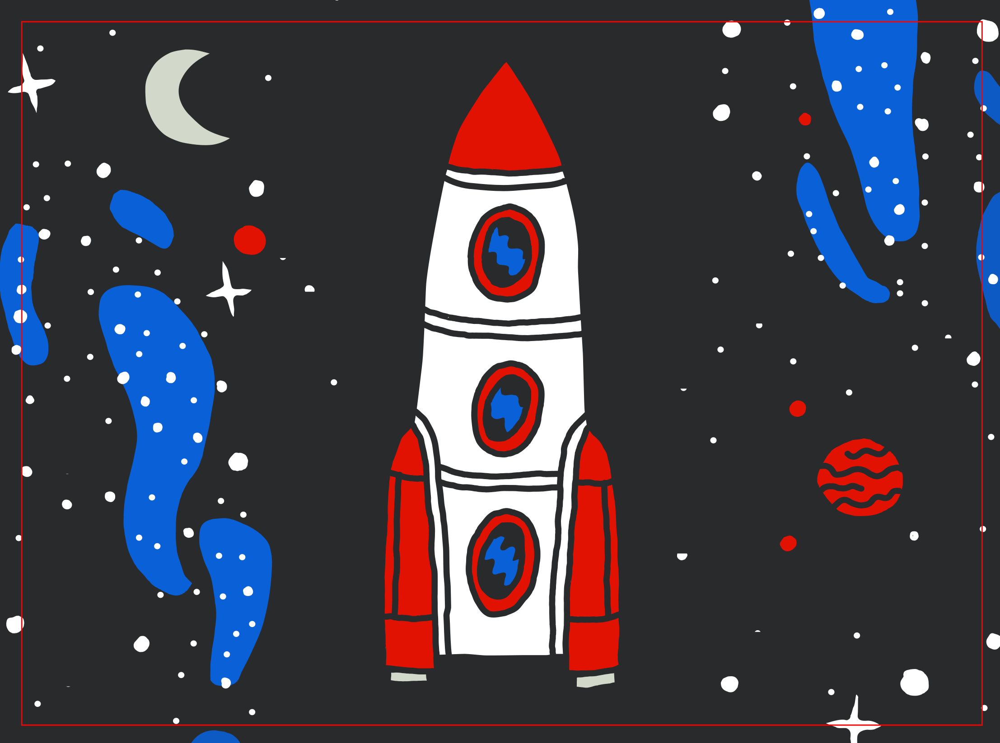

# Animations

Les titres, les séquences animés, les séquences photos fonctionnent grâce à un système de plaques et de marionnettes retro-éclairées.

On utilise principalement du plexiglas.

## Dessin et vinyle

(ceci ne concerne pas les séquences de type photo et les titres)

Épaisseur de trait : 6 mm

Couleurs :

On se limite à une palette de couleurs restreinte, du transparent (blanc) du opaque (noir) et un jeu de couleurs clairs transparente.

Les images sont faites avec du vinyle autocollant découpé au cutter numérique. (Voir [ce tuto](https://www.youtube.com/watch?v=6oG9WtHLb-w) pour l'application)


- [ORACAL 8300](https://www.orafol.com/fr/europe/produits/oracal-8300-transparent-cal) (transparent)
  - Bleu roi #049
  - Bleu clair #053
  - Vert #061
  - Jaune or #020
  - Rose saumon #089
  - Ajouter un rouge ?????
  - Gris moyen #074
  - Gris foncé #073
- [ORACAL 631](https://www.orafol.com/fr/europe/produits/oracal-651-intermediate-cal) (opaque mat)
  - noir #070

Les dessins sont faits sur Inkscape dans ce fichier : [animations/animations.svg](../animations/animations.svg)

## Mécanisme des animations et plexi

On utilise du plexiglas transparent GS.

Le GS (moulé) est plus cher mais plus rigide, se découpe mieux, meilleure finition que le XT (extrudé).

Les pièces de plexi non-rectangulaires seront découpées à la découpeuse laser.

Les mécanismes de translation sont fait avec des guides en plexi (droits ou courbes).

Chaque guide est construit avec deux épaisseurs de plexi. du 4 mm (1 mm de jeu sur l'épaisseur) pour guider. Et du 3 mm pour piéger la plaque.

Pour les mécanismes de rotation, on met aussi des guides (courbes) et si l'axe de rotation est dans la plaque, on met un boulon de classeur de 4 mm Ø dans un trou de 5 mm Ø

Les arrêtes des plaques peuvent être biseautés pour éviter d'abîmer le vinyle lorsqu'une plaque glisse sur une autre.
 
## Dimensions

L'idée est qu'aucune plaque ne dépasse 1000×1000 mm

Si une plaque devait être plus grande elle devra être démontable.

- Encombrement max : 1000×1000
- Plaque fixe :  1000×760
- Image :  951×700
- Image utile :  931×680


- "Demi-plaques" chez plexiglas : 2050×1520
- quart de "Demi-plaques" : 1025×760

## Les plaques

Il y a un peu plus d'une vingtaine de plaques. 

Certaines sont animées (méchanismes de rotation ou de translation activés par des leviers). D'autres sont fixes (décors pour film animé ou photo).

Les plaques sont projetées en étant retro-éclairées comme des plaques de lanterne magique ou des diapositives.

### Éclairage, mise et accrochage des plaques

Les plaques sont équipées de crochets.

À environ 1100 mm de l'objectif les plaques peuvent très facilement être accrochées et décrochées sur une tringle. Peut-être réfléchir à un système pour pouvoir enchaîner rapidement deux plaques, par exemple, la tringle fait la largeur de trois plaques et les plaques ont des roues (sinon on passera à chaque fois par un noir). Il faut que ces manips puissent se faire seul·e.

Cette structure est équipée de volets pour que le soleil n'éclaire pas les plaques par l'avant.

Plus loin, un grand reflecteur de 3000×3000 permet d'éclairer les plaques par l'arrière.


### Liste des plaques fixes

- Photo *Vacances* 1
- Photo *Vacances* 2
- Photo *Vacances* 3
- Photo *Mode*
- Journal *Bon sens*
- Décors *Période heureuse*
- Décors *Podium*

### Liste des plaques animées

#### Titres

C'est une plaque opaque sur les bords gauche et droite et transparente au milieu (bande transparente de 500 mm). 

Deux volets permettent d'opacifier aussi 243 mm en haut et en bas.

Un rouleau souple permet de faire défiler verticalement les titres dans la partie transparente. Le rouleau peut être coincé entre deux plaques transparentes.

Pour le générique de début et les intertitres, les volets sont fermés et c'est un titre tous les 243 mm. Pour le générique de fin, on ouvre les volets et ça défile.

#### *Prologue*

Fixe : Décors mer avec un perso sur un rocher.

Anim 1 : Petite translation en allez-retours pour animer des reflets dans l'eau (moiré ?).

Anim 2 : Longue translation horizontale pour le déplacement du bateau. La translation fait aussi apparaître des nuages de fumée au dessus du bateau (larges rayures croisées).

#### *Niveau de l'eau*

Fixe : Décors ville en perspective cavalière. (sol jaune pour casser le bleu de l'eau, imeuble blanc pour garder couleur du linge)

Anim 1 : Longue translation verticale pour faire monter l'eau.

Anim 2 : Longue translation horizontale pour faire sortir le linge.

#### *Mutation*

Fixe : Deux persos + décors + caches noirs

Anim 1 : Petite translation verticale ouverture des yeux du premier perso. Puis grande translation verticale devoile tout le premier perso.

Anim 2 : Rotation du bras et d'un grand cache (cache tout sauf le faisceau de la lampe). D'abord allume la lampe, puis dévoile le deuxième perso.


#### *Période malheureuse*

Fixe : Décors parc d'attraction et circuit montagnes russes.

Guide : pour la mario du chariot au lointain.

Anim : Rotation désaxées pour le chariot au premier plan.

#### *Golden record* 1



Fixe : La fusée et son ciel sur une bande verticale au centre

Anim 1 : Longue translation Le reste du ciel et la terre qui défilent.

Anim 2 : Pourquoi pas une autre anim de la fusée qui part vers le haut en fin de plan.

#### *Golden record* 2


Fixe : Perso et décors

Anim : Translation verticale courte en aller-retours des avants-bras tenant le disque et des yeux.

#### *Golden record* 3


Fixe : Perso sans visage ordi et décors.

- Plaque : rect 1000×700
- Mécanique : 3 rails dont 1 avec gorge
- Couleurs : #070 #089 #053 #074 #073
- Aperçu : 


Anim : Courte translation horizontale pour pouvoir changer de visage.

- Plaque : rect 760×354
- Mécanique : 1 poignée + 1 butée
- Couleurs : #070 #089
- Aperçu : 

#### *Comportement* 1

Fixe : Transparent

Anim principale : Translation verticale du personnage pour pano

Toutes les autres anims sont solidaires de l'anim principale.

Anim 1 : Translation horizontale courte en aller-retour pour le mouvement des yeux.

Anim 2 : Translation horizontale courte pour volet texte A

Anim 3 : Rotation pour gouttes de transpiration

Anim 4 : Translation horizontale courte pour volet texte B

Anim 5 : Translation horizontale courte pour rougeurs

Anim 6 : Translation horizontale courte pour volet texte C

Anim 7 : Translation horizontale courte pour volet texte D

Anim 8 : Translation horizontale courte rapide en aller-retour pour mains

Anim 9 : Translation horizontale courte pour volet texte E

Les textes A B C D peuvent se dévoiler avec les anims des symptomes concernées pour réduire le nombre de mécanisme.

#### *Comportement* 2

Fixe : 3 visages et 2 paires d'yeux.

Anim : Translation courte horizontale de 2 visages et 3 paires d'yeux pour faire les croisements de regards.

#### *Épilogue* 1

Fixe : Quasi tout opaque avec zone pour laisser apparaître le perso et trous pour effet vagues et bulles

Anim : Translation verticale. Fait apparaître le personnage petit à petit et en même temps fait clignoter les vagues.

#### *Épilogue* 2

Fixe : Décors Mer

Anim : Translation verticale aller-retour pour faire apparaître des vagues et faire flotter le perso.


## Les marionnettes

On appelle marionnette les parties mobiles des animations, qui ne sont solidaires des plaques. Ce sont des sortes de pantins articulés en 2d. 

### Liste des marios

#### *Niveau de l'eau* 1

Une personne qui tient un parapluie et qui se déplace, pas d'articulations.

#### *Niveau de l'eau* 2

Des poissons et une baleine qui se déplacent. Éventuellement une articulation pour la baleine. Souplesse entre les poissons.

#### *Période heureuse*

Une file d'attente avec 4 persos.

Les 4 pieds gauches sont articulés sur une même came. Idem pour les 4 pieds droits.

En faisant glisser une à une les 2 cames, on fait faire un pas à tout le monde.

Chaque perso a 2 articulation pied et deux articulations anches. Les persos peuvent avoir d'autres articulations pour leur donner de la souplesse et du caractère (buste, bras, tête, etc.)

#### *Podium* 1

Le Podium avec plein de marches.

On peut le déplacer vers le haut pour faire pousser le podium. Il y a des cales pour l'arrêter à chaque étapes.

Les marches sont numérotés ainsi :

```
    1
   3 2
  5   4
 7     6
   etc.
```

Marches 1, 2 et 3 : Trois persos fixes

Marches 4 : Le perso à les bras mobiles qui s'agitent et qui peuvent se replier. (2 articulations épaules.)

Marche 5 : La cinquième marche est mobile. Elle commence cachée et coulisse pour apparaître (glissière). Le perso sur la cinquième marche est caché même quand la marche est dévoilé. Quand il se dévoile, il a un un seul pied sur la marche et fait un pas pour se placer sur la marche. (2 articulations anches, 1 articulation genoux, une articulation pied)

Marche 6 : Le personnage est caché et se dévoile (2 articulations anches, 1 articulation genoux, 2 articulation pieds)

Marche 7 : Le personnage est caché et se dévoile, il a les bras en l'air qui s'agitent (2 articulations épaules, 2 articulations anches, 1 articulation genoux, 2 articulation pieds)

#### *Podium* 2

Un perso qui grimpe les marches. Il se manipule par les pieds. (2 articulations anches, 2 articulations genoux)

#### *Période malheureuse*

Un chariot de montagne russe pour le lointain. Avec éventuellement une articulation entre la tige et le chariot.


