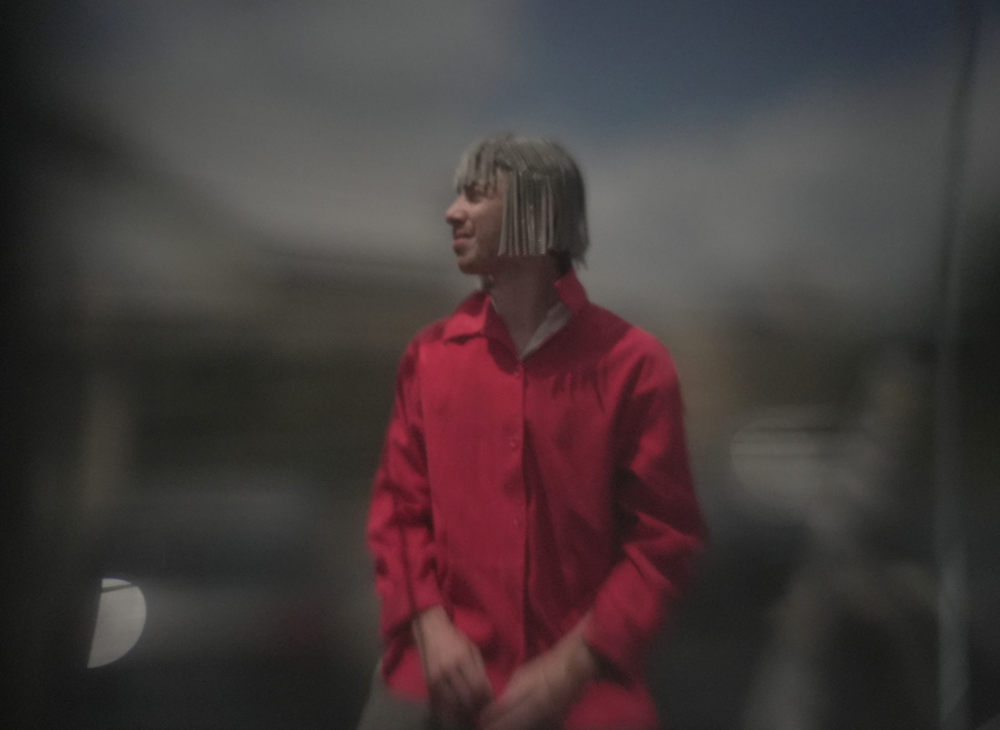

# Costumes (et maquillage, coiffure)

Les costumes ont au moins deux fonctions :
- clairement differencier tous les personnages joués par les mêmes comédiens.
- véhiculer une certaine vision du futur. (pas cliché s.f. pas trop neutre. Peut-être actuel ou pas (cf. la mode)).

Environ 12 personnages en live et 4 en photo.

## Photos costumes St-Alban

