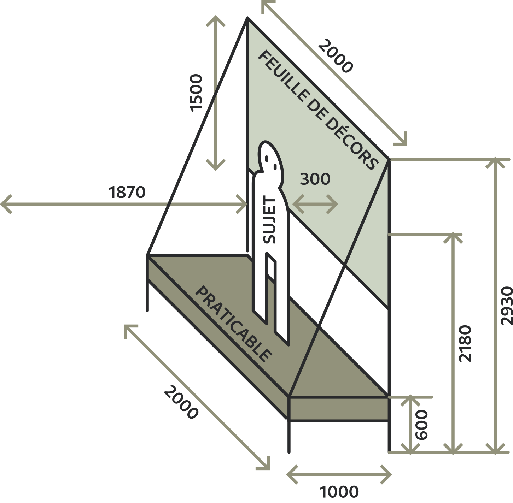
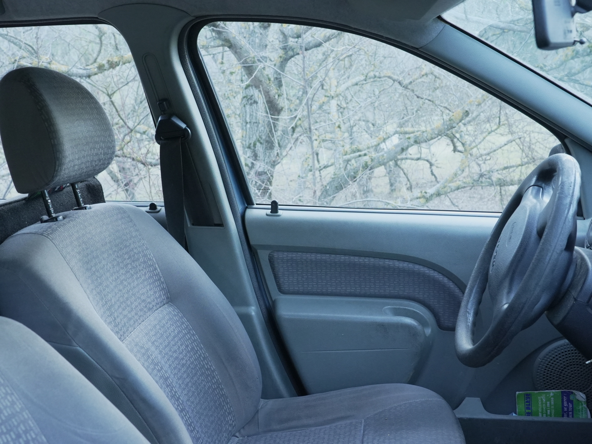
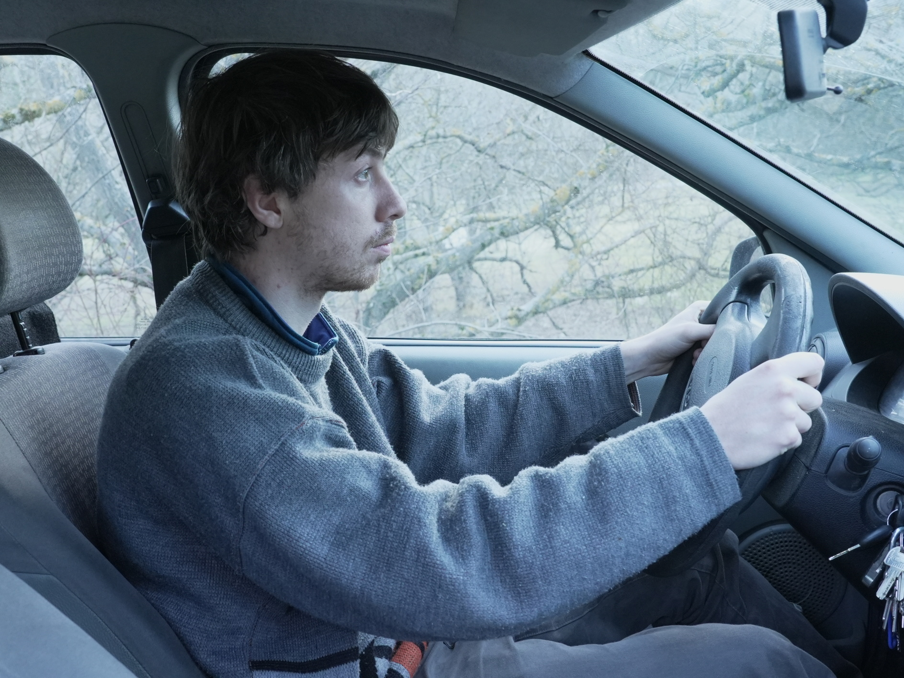
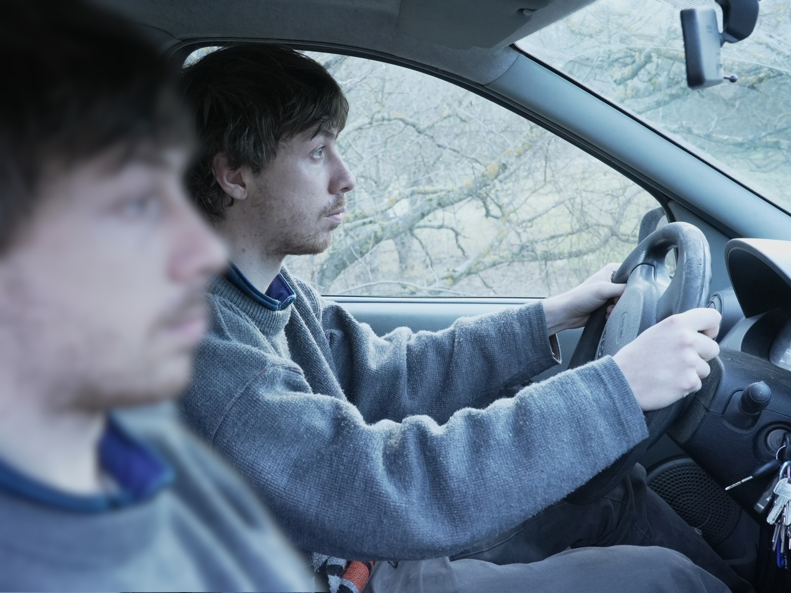

# Décors

Les décors sont réfléchis pour être filmés au 1000mm.

## Dimensions

Le décors doit être à 300 du sujet. Avec la lentille de f=1000 mm le sujet est à 1870 mm de la lentille, le décors est donc à 2170 mm. à 2170 le plan visible est de 1817×1326. En prenant ~100 de marge de chaque côté et en arrondissant on a **une feuille de décors de 2000×1500**.

Voici le tableaux des dimensions que doivent avoir les feuilles de décors en fonction de la distance relative au sujet

| distance relative | distance lentille | surface visible | avec marge de 100 |
| ----------------- | ----------------- | --------------- | ----------------- |
| 0                 | 1870              | 1565×1142       | 1765×1342         |
| 100               | 1970              | 1649×1203       | 1849×1403         |
| 200               | 2070              | 1733×1264       | 1933×1464         |
| **300**           | 2170              | 1816×1326       | **2016×1526**     |
| 400               | 2270              | 1900×1387       | 2100×1587         |
| 500               | 2370              | 1984×1448       | 2184×1648         |
| 600               | 2470              | 2067×1509       | 2267×1709         |
| 700               | 2570              | 2151×1570       | 2351×1770         |
| 800               | 2670              | 2235×1631       | 2435×1831         |

## Fond noir

Rideau noir de 2000×2300 mm suspendu à +500 (2370 mm).

## Chambre

ATTENTION : modifier au moins le decors de la chambre pour focale de 1000 mm

Une feuille de 2000×1500 mm. Tous les accéssoires sont fixés dessus :

- Moquette
- Matelas (en mousse légère).
- Litterie : Drap Drap house couette oreillée.
- Table avec livre et lampe.
- Vetements qui traînent.
- etc.

## Cuisine

Feuille de décors avec du papier-peint 2000×1500 mm

Ou portant à roulette avec tissu tendu de 2000×1500 mm

Table avec nappe et dossier de chaise réfléchis pour un faux-assis (debout sur le praticable

## Mur de brique

En faux-vertical : au sol comme si adossé à un mur.

Rouleau de lino mur de brique.

Peut-être affiche de pub pour le feu sans fumée, grafiti du futur, ou autre.

## Voiture

Voiture jouée en debout faux assis.

Une feuille de décors avec en trompe l'oeil :
  - Portière
  - Tableau de bord
  - Parbrise + vitres

Un volant sur pied.

La feuille de décors est recto verso pour contre-champ.

Ou alors une autre feuille de décors pour un plan de face.

Effets :

- Paysage qui défile (branches d'arbres à la main)
- Goutes d'eau sur la vitre

### Photos de référence

ATTENTION ces ref émulent un 750mm, sûrment plutot tournés au 1000mm
  
# Accéssoires

Facile :
- Cuillère
- Verre d'eau
- Lunettes de retournement de la vision
- Livre conducteur
- clavier
- Micro
- 2 téléphones

Effets :
- Paillette
- Buée

Moins facile :

## Prothèse

Fausses mains, journal, bust, épaule et cou sur sac à dos ?

Manipulation possible des mains (légère souplesse)

Pour masquer le vrai corps : col roulé ou tissu noir tenu à la main.

## Journaux

1. Maqueter un faux-journal qui s'appelle "Le journal".
2. L'imprimer en 1 exemplaire.
2. Prendre en photo la personne très influente qui le tient à l'envers.
3. Maquetter un autre numéro de "Le journal". Avec une photo en une.
4. L'imprimer en 10 exemplaires environ. Et aggrandir un détail du journal sur une feuille de 1000 × 730 mm. 

