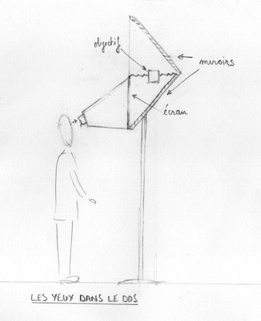
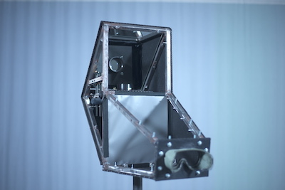

#  Les Yeux Dans Le Dos

| prototype n°                |                   01 |
|-----------------------------|---------------------:|
| nom vernaculaire            | Les Yeux Dans Le Dos |
| début construction          |        décembre 2022 |
| nombre de spectateur·ices   |                    1 |
| taille de l'image           |             30×30 cm |
| distance de tirage min-max  |                    ? |
| dimensions exterieures      |                    ? |
| objectif monté              | Process lens Zeiss S-TESSAR 5,6/300 |

[une vidéo de test des Yeux dans le dos :](https://vimeo.com/cienokill/cameraobscura-proto01)

<iframe src="https://player.vimeo.com/video/809841929?title=0&portrait=0&byline=0" width="800px" height="450px" style="position: absolute; top: 0px; left: 0px; width: 100%; height: 100%;" frameborder="0"></iframe>

## Description générale
En regardant à l'intérieur de cette camera obscura, on découvre une image à l'endroit d'environ 30 cm x 30 cm de ce qui est derrière nous.

## Allure
Une boite noire de forme complexe est fixée sur un pied de projecteur. À hauteur d'yeux on trouve un viseur en forme de lunettes de protection.

## Matériaux

### Chassis
- Tube d'acier soudé (20 mm x 20 mm).

### Parois
- Panneau de plastique alvéolaire

### Écran
- Toile de rétroprojection (translucide/dépoli) tendue sur cadre acier

### Objectif
- Process lens Zeiss S-TESSAR 5,6/300

### Miroirs

- Deux miroirs de 350×270mm

### accessoires
- L'objectif fixé sur un clamp coulisse sur 2 rails
- Un soufflet en tissu fixé entre la planchette et le chassis maintient l'obscurité.
- déport de point à l'extérieur pour faciliter le reglage de la position de l'objectif sur le rail.

## Évaluation des avantages et des inconvénients

### Avantages
- image très claire
- à l'endroit

### Inconvénients
- image relativement petite
- axe inversé
- Légère double-image due aux miroirs

## Améliorations envisagées
- vitre de protection et pare-soleil pour protèger les miroirs et l'objectif.

## Détails de construction et description technique

 
