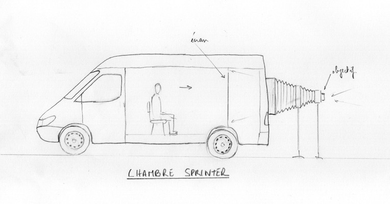
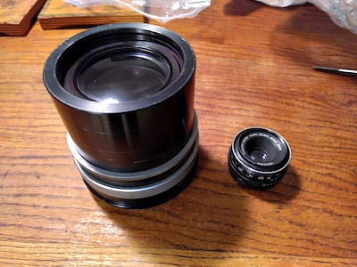
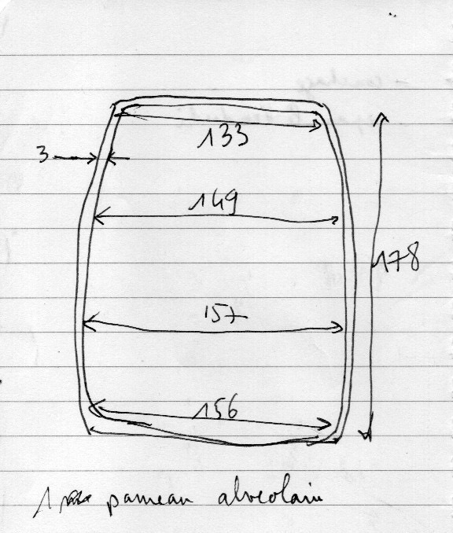

#  Chambre Sprinter

## Description générale
Un vehicule type Sprinter Mercedes est transformé en camera obscura en adaptant l'arrière du véhicule pour qu'il accueille un système soufflet/objectif. Un cadre sur lequel est fixé l'écran de 1,40 m x 1,02 m (format 1,37) est installé à l'intérieur du camion. 3 personnes peuvent visionner simultanément l'image.

## Allure
Un utilitaire avec un soufflet qui dépasse à l'arrière.

### Chassis
- Sprinter Mercedes

### Écrans testés
- Toile de rétroprojection (translucide/dépoli) tendue sur cadre

### Objectifs testés
- Process lens Wray Lustrar 1060 mm - f/16
- Process lens Nikon APO Nikkor 610 mm - f/9
- Lentille brut d’opticien 1500 mm - f/25 (ménisque)

### Accessoires
- Pour retourner l'image, il est envisagé d'utiliser un prisme en toit d'Amici, fabriqué avec 2 miroirs à 90°.

## Évaluation des avantages et des inconvénients

### Avantages
- image dans l'axe
- ultra grand format

### Inconvénients
- à l'envers

## Améliorations envisagées

## Moment envisagé pour la construction et/ou les améliorations
printemps 2023

## Détails de construction et description technique

