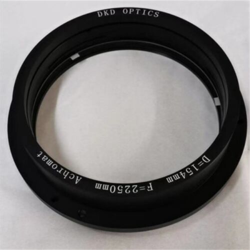

#  Chambre Sprinter

## Description générale
Un vehicule type Sprinter Mercedes est transformé en camera obscura en adaptant l'arrière du véhicule pour qu'il accueille un système soufflet/objectif. Un cadre sur lequel est fixé l'écran de 1,30 m x 0,95 m (format 1,37) est installé à l'intérieur du camion. 3 personnes peuvent visionner simultanément l'image.

[une vidéo de test de la chambre sprinter au Quai des savoirs :](https://vimeo.com/showcase/10324493/video/826499165)

<iframe src="https://player.vimeo.com/video/826499165?title=0&portrait=0&byline=0" width="800px" height="450px" style="position: absolute; top: 0px; left: 0px; width: 100%; height: 100%;" frameborder="0"></iframe>

## Allure
Un utilitaire avec un soufflet qui dépasse à l'arrière.

### Chassis
- Sprinter Mercedes

### Écrans testés
- Toile de rétroprojection (translucide/dépoli) tendue sur cadre

### Objectifs testés
- Process lens Wray Lustrar 1060 mm - f/16

- Process lens Nikon APO Nikkor 610 mm - f/9
- Lentille brut d’opticien 1500 mm - f/25 (ménisque)

- Lentille achromatique 2250 mm - f/14,6

### Accessoires
- Pour retourner l'image, il est envisagé d'utiliser un prisme en toit d'Amici, fabriqué avec 2 miroirs à 90°.

## Évaluation des avantages et des inconvénients

### Avantages
- image dans l'axe
- ultra grand format

### Inconvénients
- à l'envers

## Améliorations envisagées

## Moment envisagé pour la construction et/ou les améliorations
Essais en résidence au quai des savoirs et à MIMA avec un écran dépoli.
À MIMA, l'ecran testé est un GREY plus de 1300 x 840 mm.

## Détails de construction et description technique

