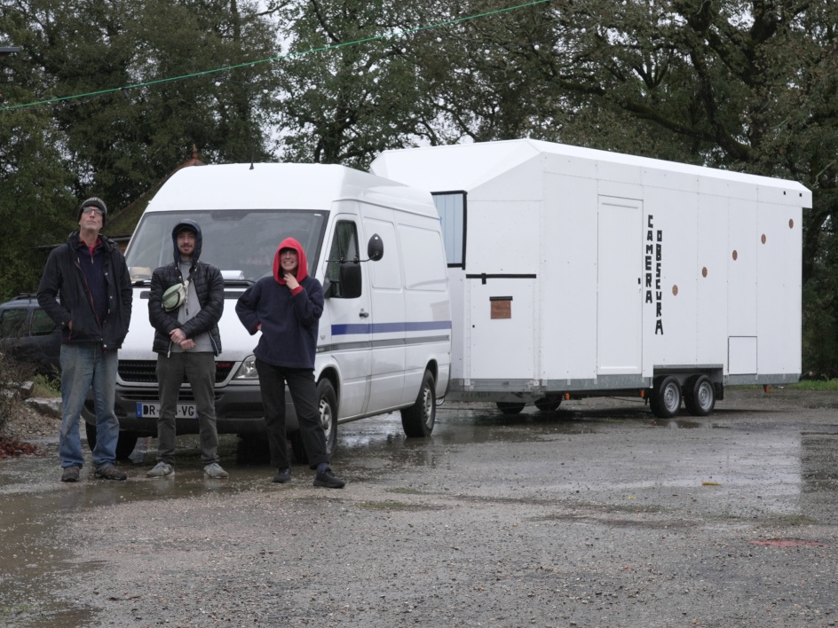
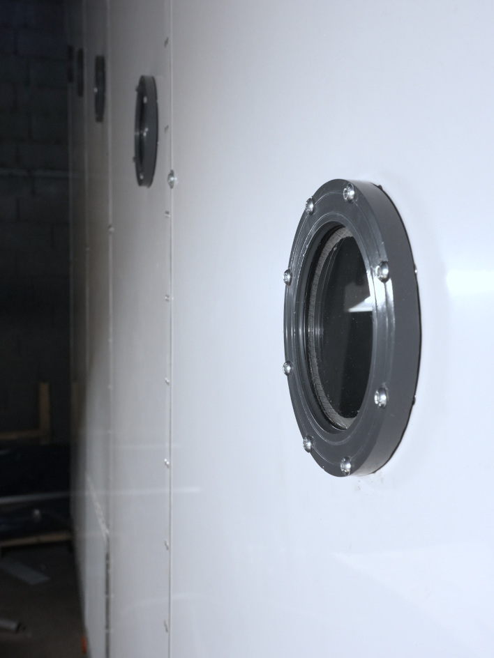
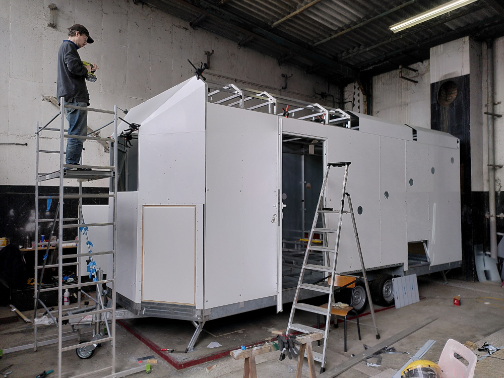
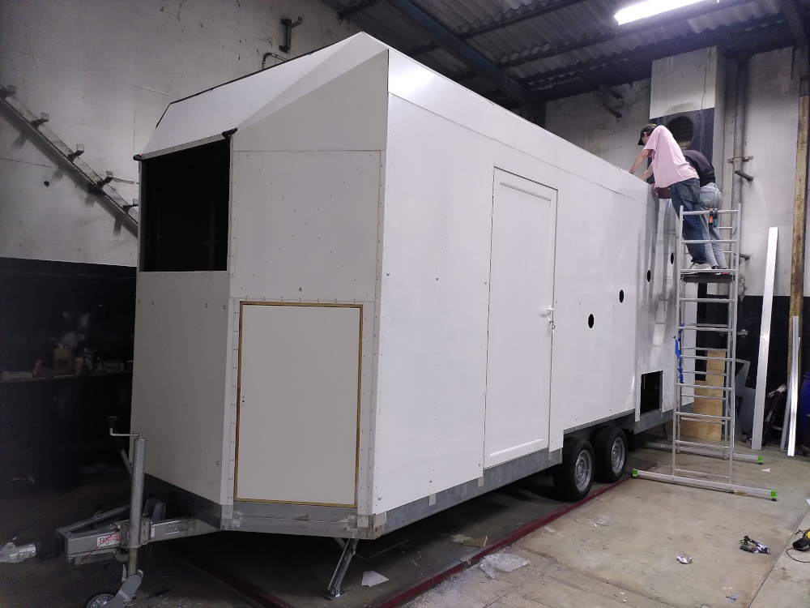
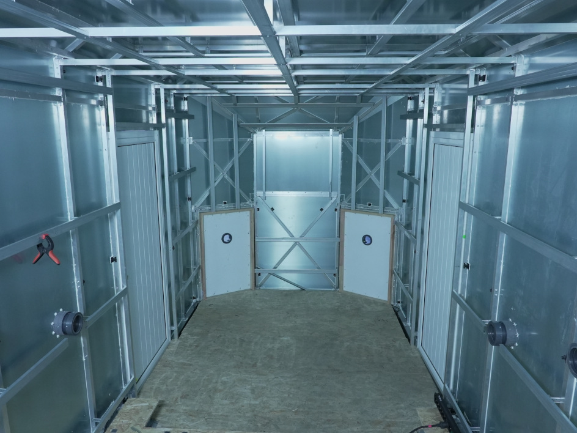
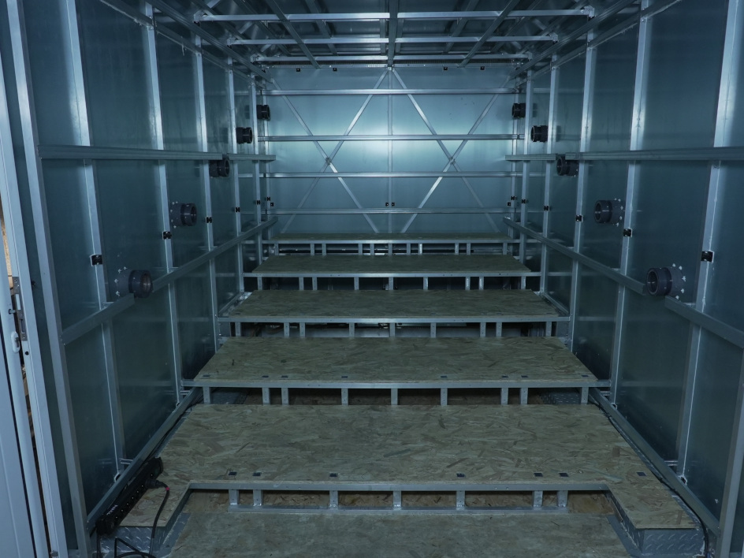
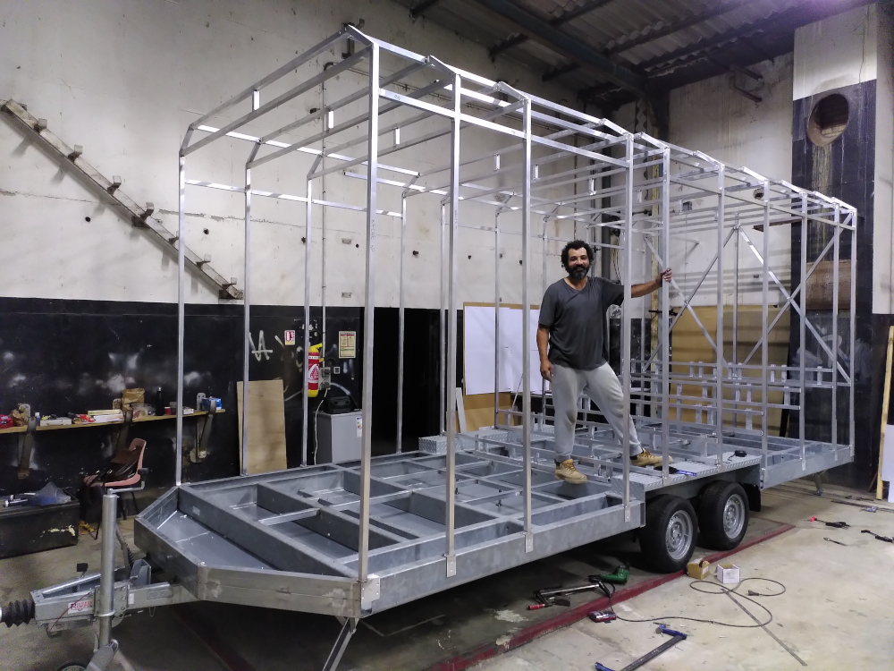

#  Chambre Remorque

## Description générale
Une remorque est transformée en cinéma itinérant en adaptant l'arrière du véhicule pour qu'il accueille un système soufflet/objectif. Un cadre sur lequel est fixé l'écran de 1,80m x 1,31 m (format 1,37) est installé à l'intérieur de la remorque. 21 personnes assisent sur un gradin peuvent assister simultanémant à la projection.

## Allure
Une remorque avec un soufflet qui dépasse.

## Matériaux

### Chassis
- Remorque BW TINY HOUSE CH 600 et charpente alu.

### Écran
- Toile de rétroprojection (translucide/dépoli) tendue sur cadre

### Objectif
- à définir

### Accessoires
- Pour retourner l'image, il est envisagé d'utiliser un prisme en toit d'Amici, fabriqué avec 2 miroirs à 90°.

## Évaluation des avantages et des inconvénients

### Avantages
- image dans l'axe
- ultra grand format
- très confortable

### Inconvénients

## Améliorations envisagées
- hublots avec fermeture (iris ?)
- trappe entre cabine et extérieur avec sas.
- rideau sur l'écran ?
- système de ventilation mécanique
- système de refroidissement paille/eau
- porte PMR 90 cm

## Moment envisagé pour la construction et/ou les améliorations
automne 2023

## Détails de construction et description technique

Fauteuils : [La page consacrée aux fauteuils](technique/fauteuils.md)

- dimension hors-tout caisse + chassis : 7473 x 2550 x 3000
- dimension hors-tout caisse : 6600 x 2450 x 2452
- dimension utile intérieur : 6400 x 2250 x 2252
- épaisseur isolation plafond ou mur : 100
- épaisseur isolation sol : 100
- entraxe siège : 450
- largeur traversée : 450

## Photos

## Plans

## Première série de plans

## Deuxième série de plans

[plan chassis remorque](/contenu/plans/doc_bw_tiny_house_ch600.pdf)

## Troisième série de plans





























Voir aussi :
- Tous les plans A1 dans un fichier [plans-remorque-merged.pdf](/contenu/plans/plans-remorque-merged.pdf)
- Le DXF de toutes les pièces qui passent par Schiavon [pieces-toles-schiavon.dxf](/contenu/plans/pieces-toles-schiavon.dxf)
- Le DXF de comment répartir les pièces en tôle laquée coupées par Aquabrasion sur 9 plaques : [pieces-par-plaque-aquabriasion.dxf](/contenu/plans/pieces-par-plaque-aquabriasion.dxf)
- Le plan A3 des pieces en tôle laquées pour Schiavon [remorque-pieces-tole-laquee-schiavon.pdf](contenu/plans/remorque-pieces-tole-laquee-schiavon.pdf)
- Le plan A3 des autres pieces en tôle pour Schiavon [remorque-detail-divers-toles-schiavon.pdf](contenu/plans/remorque-detail-divers-toles-schiavon.pdf)
