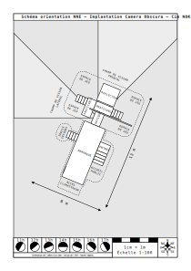

# Technique

Voici la liste des questions et spécifications techniques liés au spectacle *Camera Obscura*.

- [Introduction](introtechnique.md) : principes généraux qui guident notre travail
- [Fiche technique](fiche-technique.md)
- [Schéma d'implantation](../plans/implantation-orientation-NNE.svg): Quelle place occupe le dispositif dans l'espace public
- [Liste matos tournée](liste_matos_tournee.md) : pour ne rien oublier
- [Notice de montage](notice-montage.md) : pour monter

## Optique
- [Principes optiques](optique.md) : généralités sur la caméra obscura
- [Machinerie](machinerie.md) : quels mécanismes pour régler les differents paramètres optiques pendant le film 
- [Calage des éléments optiques](calage.md) : où placer les différents éléments optiques
- [Renversement de l'image](renversement.md) : comment retourner l'image de 180° (et autres rotations)
- [Luminosité](luminosite.md) : comment obtenir l'image la plus lumineuse possible
- [Futs](../technique/futs.md) : conceptions des futs pour les lentilles
- [Trucage optique](../technique/surimpression.md) : incrustation et surimpression
- [Soufflets](soufflets.md) : comment et pourquoi faire des soufflets
- [Iris](iris.md) : comment et pourquoi faire des iris
- [Abaque](abaque.md) : abaque des distances de tirage pour quelques objectifs
- [Vitres](vitres.md) : travailler avec des vitres et des miroirs

## Audio
- [diffusion du son dans la remorque](son.md) : comment donner l'illusion du son cinéma
- [Instrumentarium](instrumentarium.md) : instruments de musique et de bruitage

## Accueil public
- [Isolation et climatisation](isolation.md) : faire du frais dans la remorque
- [Fauteuils](fauteuils.md) : garantir un max de confort avec un minimum d'encombrement et de poid
- Vendre des pop-corns cuits au four solaire
- [Norme ERP cat 5](norme-erp.md) : les obligations des ERP de 5e catégorie (< 50 spectacteurs)
  
## Divers
- [Soleil](soleil.md)
- [Implantation](implantation.md)
- [Marionettes](marionettes.md)
- [Habillage](habillage.md)
- [Fournisseurs](fournisseurs.md) : liste de fournisseurs.
- [Vrac](vrac.md) : idées à creuser

## Documents
- [calcul_optique.ods](calcul_optique.ods) : tableur pour calcul des vartiables optiques
- [camera_obscura.doc](camera_obscura.doc) : notes de Gérard Tayeb sur differentes questions optiques
- [chantier_remorque.ods](chantier_remorque.ods) : organisation du chantier de construction de la remorque
