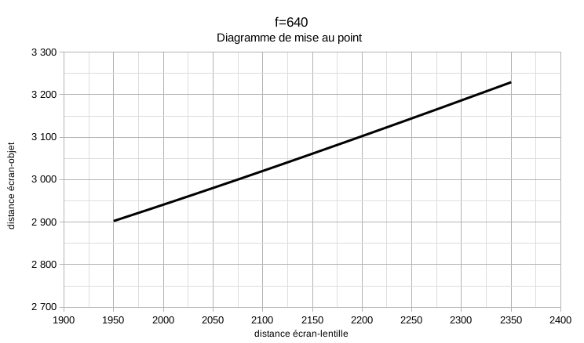
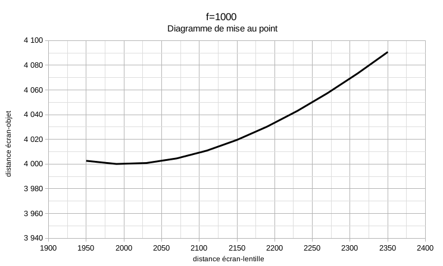
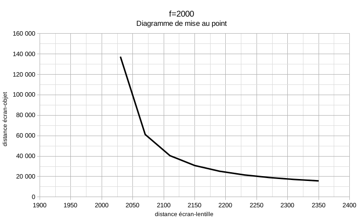

## Calage des éléments optiques

### Contraintes liées au spectacle

- Les dimensions limitées de la remorque nous imposent un léger gradinage (20 cm par rang) et une rétroprojection. C'est avec cette configuration que nous obtenons le meilleur confort de vision pour une taille de remorque raisonnable.
- La régie : Nous voulons un espace de jeu d'1,4 m dans la remorque à l'arrière de l'écran.
- Nous voulons une taille d’image de 1,80 m × 1,31 m (format 1,37) sans trop de vignettage.
- Nous voulons utiliser plusieurs objectifs avec des focales différentes et des renvois d’angle, et alterner leur usage avec un système d'obturateurs manuels afin de reproduire l’illusion d’un montage type cinéma où plusieurs plans différents s’enchaînent.

### liste des objectifs et lentilles mis en oeuvre dans les essais :

Nous sommes encore à la recherche de lentilles parfaitement adaptées à notre usage.

Objectifs et lentilles essayées et abandonnés :

- Process lens Fax Rokkor 150mm F4.5 : **Champs trop limité par le fût**
- Process lens Zeiss S-tessar 300 mm f5,6 : **Champs trop limité par le fût**
- Process lens Apo Ronar Rodenscock 360 mm - F9 : **Champs trop limité par le fût**
- Process lens Ilex Paragon 380 mm - F9 : **Champs trop limité par le fût**
- Process lens Nikon APO Nikkor 610 mm - F9 : **Champs trop limité par le fût**
- Process lens Wray Lustrar 1060 mm - F16 : **Champs trop limité par le fût**
- Lentilles brut d'opticien ø60 - 2000mm / 1500 mm / 1000 mm / 750 mm : **Très bon résultats, mais pas assez lumineux**
- Doublet achromatique ø154 - 2250 mm : **Trop d'abérations sur les bords**

Meilleur résultat obtenu avec :

- Lentilles brut d'opticien ø80 - 2000mm / 1000mm / 750mm / 660mm : **Très satisfaisant mais si on trouvait plus lumineux ce serait cool**

Lentilles en notre possession pas encore essayées :

- Doublet achromatique ø154 - 750 mm
- Lentilles "Full field diopters" (cinéma) ø138 - 2000mm / 1000mm / 500mm

Solutions envisagées mais pas encore essayées :

- Fabrication sur mesure de Lentilles ménisque ø154 - 2000mm / 1000 mm / 660 mm
- Fabrication de lentilles "maison" à partir de verres bombés d'horloges.

### Réglage de la mise au point

Le réglage de la mise au point sur le sujet qui se trouve à l’extérieur dépend directement de la distance objectif/écran (tirage) et de la focale.

Nous changeons de focale (changement d'objectif) pour changer radicalement la mise au point.

Nous déplacons la planchette (l'objectif) sur son axe pour un réglage plus fin de la mise au point. Ce mouvement est possible grace à l'utilisation d'un [soufflet](soufflet.md) d'un débatement de 40 cm.

Ces deux réglages (selection de l'objectif et translation de la planchette) sont commandés depuis la régie.

Les diagrammes suivants montrent la distance de mise au point en fonction de la distance de tirage pour les trois focales utilisées :

### Angle de champ

Pour des raisons pratiques et artistiques nous avons fixé l’angle de champ horizontal à ~45°, ce qui correspond à un tirage de ~2,2 m pour notre écran de 1,8 m.

Cet angle (~45°) correspond à un objectif de 35mm en photo (format 24x36) et à un objectif de 24mm en cinéma (format 35mm).

Contre-intuitivement, le changement de focale n'affecte pas l'angle de champ si le tirage reste le même. L'angle de champ ne dépend que du tirage (distance lentille-écran).

Lorsque l'on déplace la planchette (translation) pour faire la mise au point, l'angle de champs varie (de +/- 3°) ce qui donne un effet *zoom*.

On a pris l'habitude de parler de l'angle entre la gauche et la droite de l'image (horizontal). Plus tard lors de discussions avec des opticiens on a compris qu'il pouvait être plus pertinent de parler de l'angle diagonal. Avec notre ratio d'image (1:1,37) un angle horizontal de ~45° correspond à un angle diagonal de ~55°.

### Valeur de plan

L'option choisie pour obtenir differentes valeurs de plan est de maintenir un tirage constant et de changer la focale.

Avec une focale égale à la distance de tirage, on aura le point à l'infini et donc un plan large.

Avec une focale plus courte, l'angle ne change pas mais la distance de mise au point diminue et un personnage pourra par exemple apparaître en gros plan.

Contre-intuitivement, les longues focales nous permetteront de faire les plans larges et les courtes focales, les plans serrés.

### Dynamiques

Avec une focale fixe, comment differentes valeurs changent si l'on change la distance lentille-écran.

Distance lentille-écran          | ↗ | ↘ |
---------------------------------|---|---|
Angle de champ                   | ↘ | ↗ |
Distance lentille-objet          | ↘ | ↗ |
Distance objet-écran avec f≳1000 | ↘ | ↗ |
Distance objet-écran avec f≲1000 | ↗ | ↘ |
Grandissement objet net          | ↗ | ↘ |
Grandissement objet fixe         | ↗ | ↘ |

Avec une distance lentille-écran fixe, comment differentes valeurs changent si l'on change la focale.

Focale                           | ↗ | ↘ |
---------------------------------|---|---|
Distance lentille-objet          | ↗ | ↘ |
Distance objet-écran             | ↗ | ↘ |
Profondeur de champ              | ↗ | ↘ |
Facteur d'éclairage              | ↗ | ↘ |
Vergence                         | ↘ | ↗ |
Grandissement objet net          | ↘ | ↗ |
Grandissement objet fixe         | = | = |
Angle de champ                   | = | = |

### Valeurs et formules

Valeurs :

- Largeur écran : 1,8 m
- Angle de champ horizontal : ~45°
- Distance lentille-écran (tirage) : 2,15 m

Formules :

- Relation de conjugaison : `1/2,15 + 1/d = 1/f`
- Distance objet en fonction de la largeur objet : `d ≈ l/(2*tan(22.5)) ≈ l/0.83`
- Focale en fonction de la distance objet : `f ≈ 1/(1/2,15 - 1/d) ≈ 1/(0.47-1/d)`
- Largeur objet en donction de la distance objet : `l ≈ d*(2*tan(22.5)) ≈  d*0.83`

### Tables

Version à jour de ces tableaux : [calcul_otpique.ods](calcul_otpique.ods)

#### Système

|                     |          |
|---------------------|----------|
| **Ratio**           | **1,37** |
| **Largeur écran**   | **1800** |
| **Hauteur écran**   | **1314** |
| **Diagonale écran** | 2229     |
| **Tirage**          | **2150** |
| **Tirage min (t-)** | 1950     |
| **Tirage max (t+)** | 2350     |
| **Amplitude (amp)** | 400      |
| **CdC**             | 0,5      |

#### Angle de champ

| angle          | radian | degré    |
| -------------- | ------ | -------- |
| **horizontal** | 0,79   | **45,4** |
| horizontal t-  | 0,86   | 49,6     |
| horizontal t+  | 0,73   | 41,9     |
| **vertical**   | 0,59   | **34,0** |
| vertical t-    | 0,65   | 37,2     |
| vertical t+    | 0,55   | 31,2     |
| **diagonal**   | 0,96   | **54,8** |
| diagonal t-    | 1,04   | 59,5     |
| diagonal t+    | 0,89   | 50,7     |

#### Détail lentilles souhaitées

| **Focale**                 | **2000**   | **1000**  | **640**   | **2000**   | **1000**  | **660**   |
| -------------------------- | ---------- | --------- | --------- | ---------- | --------- | --------- |
| **Diametre**               | 154        | 154       | 154       | 80         | 80        | 80        |
| **Vergence**               | 0,5        | 1,0       | 1,6       | 0,5        | 1,0       | 1,5       |
| **Ouverture**              | 13,0       | 6,5       | 4,2       | 25,0       | 12,5      | 8,3       |
| **Ouverture conv**         | f/11       | f/5,6     | f/4       | f/22       | f/11      | f/8       |
| **Facteur d’éclairage**    | 0,52       | 0,26      | 0,17      | 0,27       | 0,14      | 0,09      |
| **Distances objet**        |            |           |           |            |           |           |
| **Ditance objet-lentille** | **28 667** | **1 870** | **911**   | **28 667** | **1 870** | **952**   |
| Ditance objet-lentille t-  | #N/A       | 2 053     | 953       | #N/A       | 2 053     | 998       |
| Ditance objet-lentille t+  | 13 429     | 1 741     | 880       | 13 429     | 1 741     | 918       |
| Ditance objet-lentille amp | #N/A       | 312       | 73        | #N/A       | 312       | 80        |
| **Distance objet-ecran**   | **30 817** | **4 020** | **3 061** | **30 817** | **4 020** | **3 102** |
| Distance objet-ecran t-    | #N/A       | 4 003     | 2 903     | #N/A       | 4 003     | 2 948     |
| Distance objet-ecran t+    | 15 779     | 4 091     | 3 230     | 15 779     | 4 091     | 3 268     |
| Distance objet-ecran amp   | #N/A       | 88        | 327       | #N/A       | 88        | 320       |
| **Profondeur de champ**    |            |           |           |            |           |           |
| **H**                      | 616000     | 308000    | 197120    | 320000     | 160000    | 105600    |
| **PPN**                    | 27392      | 1858      | 907       | 26310      | 1848      | 944       |
| **DPN**                    | 30066      | 1881      | 915       | 31487      | 1892      | 961       |
| **PDF**                    | **2674**   | **23**    | **8**     | **5178**   | **44**    | **17**    |
| **Dimensions**             |            |           |           |            |           |           |
| **Grandissement**          | **0,07**   | **1,15**  | **2,36**  | **0,07**   | **1,15**  | **2,26**  |
| **Largeur objet**          | 24 000     | 1 565     | 763       | 24 000     | 1 565     | 797       |
| **Hauteur objet**          | 17 518     | 1 142     | 557       | 17 518     | 1 142     | 582       |
| Grandissement t-           | #N/A       | 0,95      | 2,05      | #N/A       | 0,95      | 1,95      |
| Grandissement t+           | 0,18       | 1,35      | 2,67      | 0,18       | 1,35      | 2,56      |
| Grandissement amp          | #N/A       | 0,40      | 0,63      | #N/A       | 0,40      | 0,61      |
| Grandissement obj fixe t-  | 0,07       | 1,04      | 2,14      | 0,07       | 1,04      | 2,05      |
| Grandissement obj fixe t+  | 0,08       | 1,26      | 2,58      | 0,08       | 1,26      | 2,47      |
| Grandissement obj fixe amp | 0,01       | 0,21      | 0,44      | 0,01       | 0,21      | 0,42      |

#### Résumé lentilles évoquées

| **Focale**                 | **2250** | **2000**   | **1800**   | **1500**  | **1200**  | **1000**  | **750**   | **660**  | **640**  |
| -------------------------- | -------- | ---------- | ---------- | --------- | --------- | --------- | --------- | -------- | -------- |
| **Distances objet**        |          |            |            |           |           |           |           |          |          |
| **Ditance objet-lentille** | **#N/A** | **28 667** | **11 057** | **4 962** | **2 716** | **1 870** | **1 152** | **952**  | **911**  |
| Ditance objet-lentille t-  | #N/A     | #N/A       | 23 400     | 6 500     | 3 120     | 2 053     | 1 219     | 998      | 953      |
| Ditance objet-lentille t+  | 52 875   | 13 429     | 7 691      | 4 147     | 2 452     | 1 741     | 1 102     | 918      | 880      |
| **Dimensions**             |          |            |            |           |           |           |           |          |          |
| **Grandissement**          | **#N/A** | **0,07**   | **0,19**   | **0,43**  | **0,79**  | **1,15**  | **1,87**  | **2,26** | **2,36** |
| **Largeur objet**          | #N/A     | 24 000     | 9 257      | 4 154     | 2 274     | 1 565     | 964       | 797      | 763      |
| **Hauteur objet**          | #N/A     | 17 518     | 6 757      | 3 032     | 1 660     | 1 142     | 704       | 582      | 557      |
