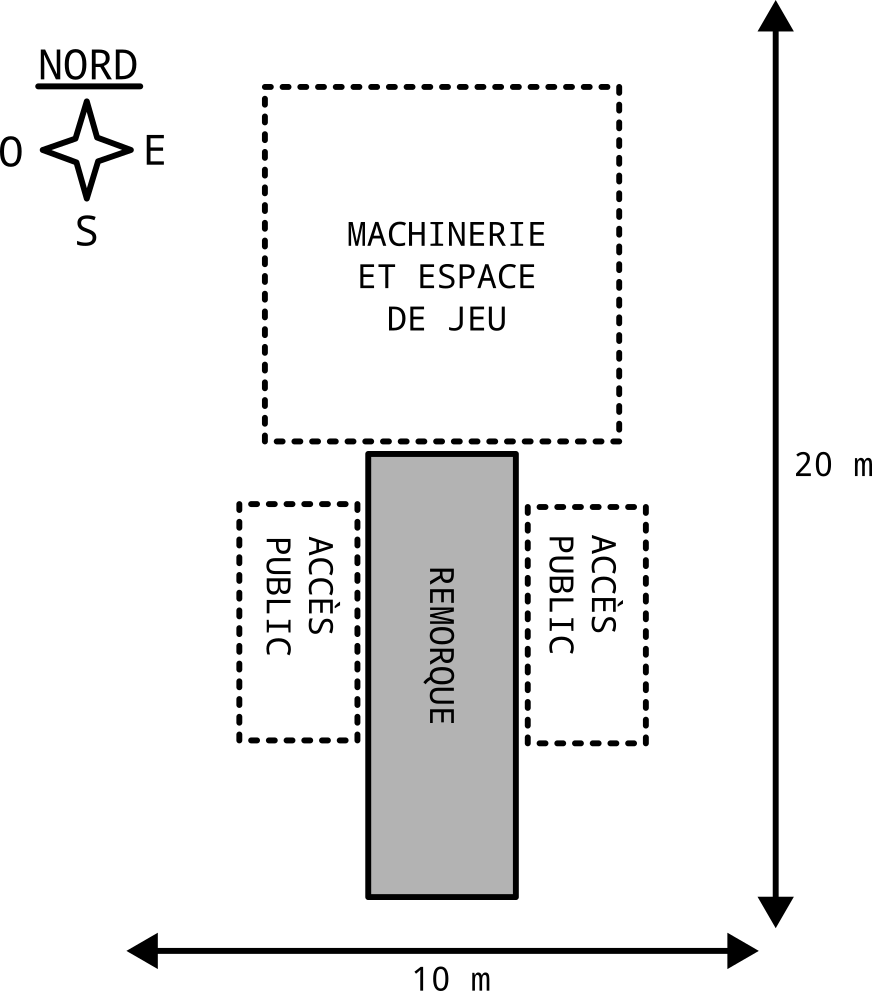

# Fiche technique - Camera Obscura - Cie NOKILL

## Équipe

### Contact comédien·nes
- Léon Lenclos - 06 27 65 68 33 – contact@leonlenclos.net
- Bertrand Lenclos - 06 09 90 38 97 - bebert@nokill.fr
- Lucile Balezeaux - 06 64 08 84 31 - lucile.balezeaux@gmail.com

### Contact technique
- Léon Lenclos - 06 27 65 68 33 – contact@leonlenclos.net
- Bertrand Lenclos - 06 09 90 38 97 - bebert@nokill.fr

### Contact diffusion
- Amparo Gallur – 07 68 52 29 53 – cie@nokill.fr

## Représentations

### Résumé
Camera Obscura est une salle de cinéma itinérante. Le public entre à l'interieur de la camera obscura pour assister à la projection d'un film produit en direct à l'exterieur.

### Durée 
- Accueil public : 5 minutes
- Spectacle : 20 minutes
- Sortie : 5 minutes

Total : 30 minutes

### Horaires
4 représentations par jour à des horaires ensoleillée.

Par exemple :
- 11h00 - 11h30
- 13h00 - 13h30
- 14h30 - 15h00
- 16h00 - 16h30

## Public

### Jauge 
Par représentation :

- 21 places assises
- ou 19 places assises + 1 place PMR
- ou 17 places assises + 2 place PMR

4 places supplémentaires en sur-jauge (sur les marches).

### Accessibilité
- Accès PMR : En cours de conception, accès non-garanti pour l'instant.
- Personnes malvoyantes : peut convenir (Contient textes, bruitages et musiques).
- Personnes malentendantes : peut convenir (Spectacle très visuel).

## Accueil

### Accès au site
Caractéristiques :
- Hauteur remorque : 3,5 m
- Largeur remorque : 2,5 m
- Longueur remorque : 7,5 m
- Longueur remorque + tracteur : 
- poids : inférieur à 3,5 t

Itinéraire d'accès au site à prévoir en amont avec la compagnie.

### Montage/Démontage

- Montage : 1 jour
- Démontage : 1 jour
- Pas de technicien·ne supplémentaire nécessaire pour le montage

### Transport, repas, nuitées

À la charge de l'organisateur (pas de régime alimentaire particulier).

## Besoins techniques

### Implantation

- Dimensions remorque : 2,50 × 7,5 m
- Espace nécessaire : 10 × 20 m
- Orientation : L'avant de la remorque doit être orienté vers le nord.
- Ensoleillement : L'espace de jeu doit être ensoleillé aux heures de jeu.

La Camera Obscura s'installe en ville ou à la campagne, sur une place agîtée, dans une zone industrielle abandonnée, dans un parc, en pleine nature, au coeur d'un festival, etc.

###  À fournir

- Un point d'eau (pour remplir des bidons pour lester le matériel et pour remplir le système de refroidissement de l'air)

