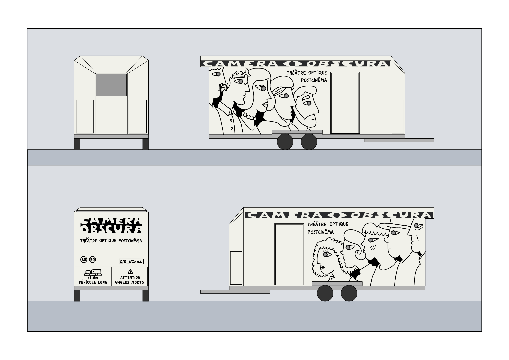

# Habillage de la remorque

De base on a fait une carosserie en [tôle Aluminium](https://e-steel.arcelormittal.com/FR/fr/Aluminium/Tole-Aluminium/Tole-aluminium-laquee/Tole-aluminium-laquee-poudre/p/P610030040) laquée poudre [RAL9016](https://ral-couleur.fr/ral-classic-nuancier/nuances-de-blanc-et-noir/ral-9016/). La tôle est assemblée avec des rivets.

Sur la tôle on veut mettre un dessin qui ressemble à ça :

Les dessins sont fait avec du vinyle autocollant ([ORACAL 641](https://www.orafol.com/fr/europe/produits/oracal-641-intermediate-cal) noir #070) découpé au plotter de découpe.

### fichiers

- Rouleaux imprimés en juin [svg](../plans/remorque-aspect-rouleau-juin.svg)/[dxf](../plans/remorque-aspect-rouleau-juin.dxf)
- Rouleaux pour le dessin (juillet) :
  - Rouleau 1 [svg](../plans/remorque-aspect-rouleau-1.svg)/[dxf](../plans/remorque-aspect-rouleau-1.dxf)
  - Rouleau 2 [svg](../plans/remorque-aspect-rouleau-2.svg)/[dxf](../plans/remorque-aspect-rouleau-2.dxf)
  - Rouleau 3 [svg](../plans/remorque-aspect-rouleau-3.svg)/[dxf](../plans/remorque-aspect-rouleau-3.dxf)
  - Rouleau 4 [svg](../plans/remorque-aspect-rouleau-4.svg)/[dxf](../plans/remorque-aspect-rouleau-4.dxf)
  - Rouleau 5 [svg](../plans/remorque-aspect-rouleau-5.svg)/[dxf](../plans/remorque-aspect-rouleau-5.dxf)
- Le fichier de base [svg](../plans/remorque-aspect.svg)

### Découpage en région

Pour économiser du vinyle on a découpé le dessin en ~70 régions, le découpage est détaillé sur ce document : [remorque-aspect-doc.pdf](../plans/remorque-aspect-doc.pdf)

### Liste des régions

La liste des régions du dessin avec leur tailles en millimètre est aussi dispo dans [ce tableur](habillage-remorque.ods)

#### Face est

| **NOM** | **W** | **H** |
| ------- | ----- | ----- |
| **E01** | 500   | 149   |
| **E02** | 250   | 176   |
| **E03** | 500   | 437   |
| **E04** | 500   | 1299  |
| **E05** | 125   | 340   |
| **E06** | 250   | 425   |
| **E07** | 500   | 373   |
| **E08** | 500   | 571   |
| **E09** | 500   | 556   |
| **E10** | 250   | 176   |
| **E11** | 500   | 1084  |
| **E12** | 125   | 152   |
| **E13** | 250   | 115   |
| **E14** | 250   | 248   |
| **E15** | 250   | 106   |
| **E16** | 125   | 221   |
| **E17** | 375   | 223   |
| **E18** | 500   | 511   |
| **E19** | 500   | 1081  |
| **E20** | 250   | 624   |
| **E21** | 250   | 361   |
| **E22** | 375   | 115   |
| **E23** | 500   | 164   |
| **E24** | 500   | 353   |
| **E25** | 125   | 165   |
| **E26** | 125   | 175   |
| **E27** | 375   | 235   |
| **E28** | 375   | 144   |
| **E29** | 250   | 665   |
| **E30** | 375   | 196   |
| **E31** | 500   | 843   |
| **E32** | 250   | 262   |
| **E33** | 500   | 299   |
| **E34** | 250   | 72    |
| **E35** | 250   | 185   |
| **E36** | 250   | 176   |
| **E37** | 500   | 592   |
| **E38** | 250   | 646   |
| **E39** | 125   | 238   |

#### Face ouest

| **NOM** | **W** | **H** |
| ------- | ----- | ----- |
| **O01** | 250   | 698   |
| **O02** | 500   | 537   |
| **O03** | 500   | 536   |
| **O04** | 375   | 233   |
| **O05** | 375   | 440   |
| **O06** | 125   | 842   |
| **O07** | 250   | 1506  |
| **O08** | 500   | 173   |
| **O09** | 250   | 111   |
| **O10** | 250   | 190   |
| **O11** | 500   | 556   |
| **O12** | 250   | 321   |
| **O13** | 250   | 110   |
| **O14** | 250   | 739   |
| **O15** | 250   | 159   |
| **O16** | 500   | 516   |
| **O17** | 375   | 179   |
| **O18** | 250   | 165   |
| **O19** | 500   | 368   |
| **O20** | 250   | 596   |
| **O21** | 500   | 576   |
| **O22** | 500   | 98    |
| **O23** | 250   | 556   |
| **O24** | 500   | 476   |
| **O25** | 500   | 213   |
| **O26** | 250   | 186   |
| **O27** | 125   | 603   |
| **O28** | 250   | 984   |
| **O29** | 250   | 333   |
| **O30** | 375   | 263   |
| **O31** | 125   | 218   |
| **O32** | 500   | 376   |
| **O33** | 250   | 846   |
