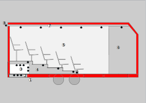

# Gestion de la chaleur à l'intérieur de la remorque

Camera Obscura est un spectacle de rue, diffusé en été, et nécessitant une bonne luminosité extérieure. La remorque est donc placée en plein soleil et le problème du confort thermique des spectateurs est un point essentiel.

Nous trouvons des solutions techniques dans les domaines suivants :

## Isolation

### Surface de la remorque

La remorque est majoritairement blanche pour refléter un maximum du rayonnement solair.

### Isolation thermique

Utilisation d’un isolant efficace, de faible épaisseur et de faible poids. Les contraintes de dimension (largeur) et de jauge (24 spectateurs) nous imposent une épaisseur d’isolant réduite.

Épaisseur de l'isolant : 100 mm.

#### Sandwich

 Pour l'isolation des parois et du plafond, de l'exterieur à l'interieur :

| materiaux | épaisseur | rôle | lien |
|-----------|-----------|------|--|
| Tôle alu laquée           | 1.5mm | Finition + Rigide + Réflecteur | [lien](https://e-steel.arcelormittal.com/FR/fr/Aluminium/T%C3%B4le-Aluminium/T%C3%B4le-aluminium-laqu%C3%A9e/T%C3%B4le-aluminium-laqu%C3%A9e-poudre/p/000000000002120158) |
| Panneau coton METISSE | 100mm  | Isolant | [lien](https://www.eco-logis.com/boutique/isolation/laine-coton-panneaux/?attribute_conditionnement=BUITEX) |
| Protecflam HDF | 2,5mm  | Rigide |[lien](https://protecflam.fr/fibroflam-panneaux-ignifuges/73-fibroflam-igni-m-protection-ignifuges-hdf.html) |
| Kalmut  | 2mm | Finition | [lien](https://www.azur-scenic.com/produit/kalmuk/) |

L'épaisseur totale réelle est de 104,5mm

Pour le faux plafond

| materiaux | épaisseur | rôle | lien |
|-----------|-----------|------|--|
| Tôle alu laquée           | 1.5mm | Finition + Rigide + Réflecteur | [lien](https://e-steel.arcelormittal.com/FR/fr/Aluminium/T%C3%B4le-Aluminium/T%C3%B4le-aluminium-laqu%C3%A9e/T%C3%B4le-aluminium) |
| Panneau coton METISSE | 100mm  | Isolant | [lien](https://www.eco-logis.com/boutique/isolation/laine-coton-panneaux/?attribute_conditionnement=BUITEX) |
| Protecflam HDF | 2,5mm  | Rigide |[lien](https://protecflam.fr/fibroflam-panneaux-ignifuges/73-fibroflam-igni-m-protection-ignifuges-hdf.html) |
| Air            | 100mm ? | Aération | |
| Protecflam HDF | 2,5mm  | Rigide |[lien](https://protecflam.fr/fibroflam-panneaux-ignifuges/73-fibroflam-igni-m-protection-ignifuges-hdf.html) |
| Peinture noire  | | Finition | |

Pour l'isolation du sol

| materiaux | épaisseur | rôle | lien |
|-----------|-----------|------|--|
| Tôle galva brut | 0,8mm | Rigide |  |
| Panneau coton BUTEX | 100 mm  | Isolant | [lien](https://www.eco-logis.com/boutique/isolation/laine-coton-panneaux/?attribute_conditionnement=BUITEX) |
| OSB | 15mm | Rigide | [lien](https://www.panofrance.fr/p/panneaux/panneau-kronoply-osb3-milieu-humide-250x125cm-15mm-A1012584) |
| Moquette | 6 mm | Finition + Isolant | [lien](https://www.saint-maclou.com/produit/moquette-velours-roxane-col-noir-rouleau-4-00-m-002109-00098#photos) |

#### Overtures

Bouches :

- Bouche d'aeration du faux plafond à l'exterieur
- Bouche d'aeration du faux plafond à l'interieur
- Bouche d'aeration de l'interieur à sous les gradins
- Bouche d'aération de sous les gradins à sous la remorque

Vitres :

- 10 hublots (2 vitres de 4mm par hublot)
- Vitre de projection  (6mm)

Portes :

- Portes public
- Trappes régie
- Trappes arrière

## L'air dans la remorque

On va aborder 3 axes :

- On veut que l'air soit bien renouvelé pour éviter que l'atmosphère soit "étouffante".
- On veut que la température de l'air soit basse pour qu'il fasse pas trop chaud.
- On veut des petits courants d'air pour donner une sensation de frais aux gens.

## Schéma

- En rouge : L'épaisseur d'isolant.
- Flèches : Direction de l'air à chaque endroit où une bouche d'aération permet une circulation de l'air.
- Zones :
  1. Sous la remorque : l'endroit ou l'air est le plus frai (voir : [raffraichissement-de-lair](Raffraichissement de l’air))
  2. Une bouche d'aération laiss entrer l'air de l'exterieur vers l'interieur.
  3. Sous le gradin : le système de ventilation (voir : [renouvellement-de-lair](Renouvellement de l’air))
  4. Sous le gradin : l'endroit le plus frais de la remorque, une bouche sous chaque paire de siège envoie l'air aux pieds des spectateurs.
  5. La salle : au plafond des bouches laissent s'échappé l'air par le faux-plafond, Des petits ventilateurs peuvent être placés pour donner une sensation de frais (voir :  [sensation-de-frais](Sensation de frais)).
  6. La régie.
  7. Le faux plafond : un large conduit de 80mm de hauteur qui permet d'évacuer l'air sans faire entrer de lumière.
  8. Évacuation : l'air ressort par le haut.

### Renouvellement de l’air

Mise en place d'un système de renouvellement de l’air à l’intérieur de la remorque. Système d'extraction d'air composé d'un faux-plafond équipé de bouches d'aération qui débouchent sur l'extérieur, à l'arrière de la remorque.

L'arrivée d'air se fait par le sol à travers des bouches d'aération individuelles sous chaque siège.

Cette implantation permet une convection naturelle qui est utile, mais pas suffisante par grandes chaleurs.

En cas de grandes chaleurs, on ajoute donc 2 grands ventilateurs (ventilateurs de voiture sur batterie) sous le gradin, sur la grille d'entrée de l'air.

### Raffraichissement de l’air

L'air arrive de sous la remorque, c'est naturellement l'endroit où l'air est le plus frais.

Pour qu'il soit encore plus frais on mouille le sol. Si c'est de l'herbe on mouille l'herbe et ça marche super bien. Sinon on a aussi des gros tapis qu'on place sous la remorque et qu'on mouille et ça marche bien aussi.

L'idée de rafraîchir l'air sur le trajet du flux avec un matériaux humidité, s'inspire des climatisations pour chapiteau, ou un flux d'air traverse un ballot de paille humide. À un moment on a un peu essayé un truc comme ça mais c'était pas si efficace et ça sentait très fort...

Voir : RAE, [rafraîchisseur d'air évaporatif (wikipedia)](https://fr.wikipedia.org/wiki/Refroidisseur_par_%C3%A9vaporation)

### Sensation de frais

Avoir un petit courant d'air sur sa peau c'est ce que les gens cherchent en utilisant un ventilateur ou un éventail par exemple. Ça ne rafraîchis pas l'air mais ça déplace la fine couche d'air tiède-humide qui flotte autour de notre corps et ça fait du bien.

On a donc placé un ventilateur à l'intérieur orienté directement sur le public.

## Améliorations envisagées pour l'été 2025

### Doubler les ventilateurs sous les gradins 

Au lieu de deux ventilateurs pour le renouvellement de l'air on passera à 4 ventilateurs.

### Amélioration sensation de frais

Au lieu d'un ventilateur au sol pour la sensation de frais, on installera une série de ventilateurs plus petits en hauteur, plus précisément dirigés sur les differentes zones du gradins

## Amélioration évoquées pour le long terme

Les hélices des ventilateurs de renouvellement de l'air pourraient être entraînés par un système de poids entraînant un engrenage et remonté entre chaque représentation. Un système de poulies peut permettre de démultiplier la longueur de corde.

