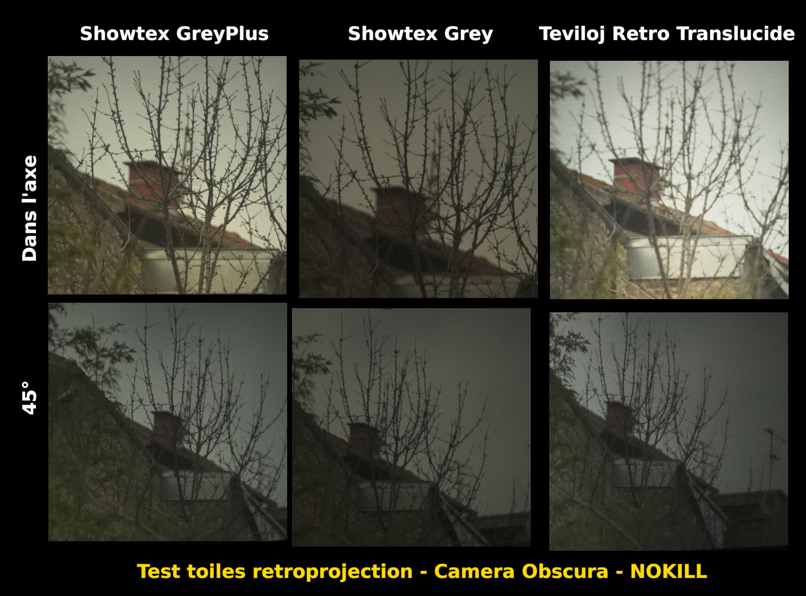

## Luminosité de l’image

Nous souhaitons que l’image soit la plus lumineuse possible. Solutions envisagées :

### Choix des périodes de jeu

Pour maximiser la luminosité de l’image la première chose à faire est de maximiser la luminosité du sujet filmé. Notre seule source de lumière étant le soleil, il sera necessaire de limiter les moments de jeu :

- plage horaire (e.g. de 11h à 16h)
- période de l’année (e.g. mai-septembre)
- conditions météo (ciel dégagé).

Ces conditions sont contraignantes, nous souhaitons les assouplir au maximum en travaillant sur les deux points suivants.

### Luminosité du système optique

- Pour obtenir un maximum de luminosité, il est nécessiaire d’utiliser des très grandes lentilles.

- Il nous a semblé important d’utiliser des objectifs achromatiques, asphériques afin de limiter au maximum les aberrations et obtenir une bonne qualité d’image qui évoque les impressions ressenties dans une salle de cinéma. Nous avons donc recherché ce type d'objectifs, mais avec de très grands diamètres pour gagner en luminosité. Nous avons trouvé des optiques qui répondent partiellement à ces critères : les process lens. Mais, même sur les plus gros modèles, les lentilles ne dépassent jamais 100 mm de diamètre et la focale dépasse rerament 1000 mm. De plus l'angle de champ est limité par le fut et la taille de l'image est insufisante pour couvrir tout l'écran.

- Nous nous sommes posés la question de savoir si des lentilles simples, de très grand diametre (200 mm ou plus) apporteraient un plus en terme de luminosité, sans trop sacrifier la qualité de l'image. Les tests avec des lentilles simples ont été assez concluants en terme de qualité. Avec 4 lentilles d’opticien brutes, forme ménisque (diamètre 60 mm, vergence 0,5 - 0,75 - 1 et 1,5 dioptrie) nous avons obtenus un piqué correct sur tout l’image qui par ailleurs couvre tout l'écran. Mais la luminosité reste insuffisante du fait du faible diamètre.

- Une luminosité satisfaisante a été obtenue avec une lentille achromatique (doublet) destinée à une lunette astronomique (diamètre 154 mm - focale 2250 mm) : résultat excellent piqué au centre, très mou sur les bords avec pas mal d’aberrations, pas de problème avec la taille de l'image.

- Le bilan provisoire de ces essais est que la qualité d'image obtenue avec les lentilles d’opticien nous convient mais qu’il faudrait les trouver ou les faire fabriquer avec un diamètre d'au moins 150 mm pour augmenter leur luminosité.

### Obscurité de la salle

La salle où le public est installé doit être la plus obscure possible. Cela ne changera pas la luminosité réelle de l’image mais la luminosité ressentie.
 Cela implique :

- Une parfaite étanchéité lumineuse de la salle.
- Les murs de la salle faits dans des materiaux sombres, reflétant très peu la lumière, afin que la lumière de l’écran “bave” le moins possible sur les murs.

### Rendement de l'écran

L'image est projetée en rétroprojecion (par l'arriére de l'écran). Differentes qualités de toiles de rétroprojection existent. Après plusieurs essais 2 solutions sont possibles :
- le Teviloj Retro Translucide, il est très lumineux, malheureusement l'image s'assombrit dès qu'on s'éloigne de le l'axe.
- le Showtex GreyPlus, moins lumineux mais plus tolérant hors de l'axe.

