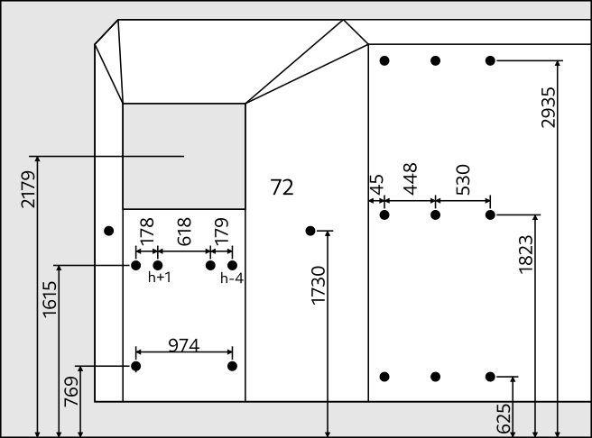

# Machinerie optique

À l'avant de la camera obscura on monte un système mécanique et optique complexe, roues, pignons, pistons, courroie, rails, soufflet, lentilles, miroirs... Ce système répond à plusieurs besoins liés à l'image, il nous permet de jongler entre différentes valeurs de plan, de régler la mise au point, de faire des surimpressions, d'avoir différents axes de prise de vue, etc.

## Réglage

Certains paramètres se règlent depuis la régie (espace situé derrière l'écran à l'intérieur de la camera obscura) :

- réglage du tirage (mise au point)
- choix de la lentille (focale)
- commande des obturateurs (cuts, fondus, noirs, surimpressions)

D'autres réglages se font depuis l'extérieur :

- Manoeuvre des miroirs (axe de prise de vue/renversement)

La commande des obturateurs et du choix de la lentille peut aussi se faire à l'extérieur.

## Structures

Les structures principales sont en tube alu de ø50 ou de ø35 :

- en magenta : [la cage](#cage)
- en rouge : [le rail](#rail)
- en bleu : [le chariot](#chariot)

## Éléments fixes

Les éléments fixes sont les éléments solidaires de la remorque.

Ils sont fixés à la remorque grâce à des crochets vissés sur les manchons de la remorque.

Rappel de la position des manchons au nord de la remorque :

### Cage

- Fait en tube alu rond de 50 (~ 14 m).
- Les dimensions du plans sont les dimensions entre axes.
- Les barres HE et HW sont fixés sur les côtés de la remorque avec 4 crochets ø50.
- En bleu : 2 raccords à 90° (ref. [RAC 90° Ø 50mm](https://raccords-tubes-centurion.fr/raccord-tubulaire-diametre-50mm/220-raccord-rac-90-diametre-50mm)).
- En cyan : 2 layhers (Socle d'échafaudage réglable à vis) pour ajuster la hauteur et s'adapter au terrain.
- Sur NE et NW on fixe la tringle des plaques avec des crochets (voir plus bas).

Le rôle de la cage est surtout de porter la tringle des plaques :

- Un plat alu
- Fixé à la cage avec 2 crochets ø50.
- Épaisseur : 3
- Largeur : 60 ???
- Longueur : 3200 (3 plaques + 200 de marge)
- Hauteur du haut de la tringle : 2590 ?? (hauteur de l'axe optique (2179) + distance entre centre de la plaque et axe poulie (436?) - rayon primitif poulie (49/2))
- Conçu pour poulies trapézoïdale [PTGT 49 13 17](https://www.tridistribution.fr/poulie-de-tension-pour-courroie/20573-poulie-en-nylon-6-30-fv.html)
- Plus d'infos sur les plaques sur la page [objet/animations](../objet/animations.md)

### Rail

C'est le rail sur lequel roule le chariot.

- Fait en tube alu rond de 50 (~ 11 m).
- Les dimensions du plans sont les dimensions entre axes.
- Les barres HE et HW sont les deux rails du traveling
- Longueur utile : Taille du chariot (550) + amplitude soufflet (400) ≃ 1000.
- En rouge : 4 raccords en té (ref. [RC2 Ø 50mm](https://raccords-tubes-centurion.fr/raccord-tubulaire-diametre-50mm/203-raccord-rc2-diametre-50mm)).
- En bleu : 2 raccords à 90° (ref. [RAC 90° Ø 50mm](https://raccords-tubes-centurion.fr/raccord-tubulaire-diametre-50mm/220-raccord-rac-90-diametre-50mm)).
- En cyan : 4 layhers (Socle d'échafaudage réglable à vis) pour ajuster la hauteur et s'adapter au terrain.
- 4 crochets ø50 fixés sur 4 manchons de la face sud de la remorque (sous la vitre) s'accrochent aux barres SW et SE, sous et au dessus du raccord en té.
- éventuellement HS pourra accueillir un palier pour reprendre l'arbre de commande.

## Éléments mobiles

Les éléments mobiles sont tous les éléments qui bougent en même temps que les optiques lors des réglages de mise au point.

L'élément mobile principal est le chariot.

Éléments mobiles qui ne sont pas démontés du chariot au stockage/transports :

- La partie nord de l'arbre rigide de commande
- La planchette
- La tourelle d'objectifs
- La courroie

Éléments mobiles que l'on démonte du chariot :

- Miroir Amici (montage avec une barre de ø35 et 6 crochets ø35) 
- Miroir 45° (montage avec 2 crochets ø35)
- La partie sud de l'arbre rigide de commande
- Les arbres flexibles de commande

### Chariot

Les dimensions du chariot répondent à des contraintes liées au champ (les barres verticales ne doivent pas apparaître à l'image). La base est plus large pour assurer une meilleure stabilité du charriot sur le rail (porte-à-faux du miroir Amici).

- Fait en tube alu rond de 35 (~ 10 m).
- Les dimensions du plans sont les dimensions entre axes.
- En vert : 2 × 4 Roues de skate montées en biais sur BW et BE.
- En rouge : 12 raccords en té (ref. [RC2 Ø 35mm](https://raccords-tubes-centurion.fr/raccord-tubulaire-diametre-35mm/78-raccord-rc2-diametre-35mm)).
- En bleu : 2 raccords à 90° (ref. [RAC 90° Ø 35mm](https://raccords-tubes-centurion.fr/raccord-tubulaire-diametre-35mm/93-raccord-rac-90-diametre-35mm)).
- En magenta : 2 paliers à semelle de l'arbre rigide de commande au centre de BS et de BN. (ref. [SKP 000](https://www.ici-composants.com/miniature-inox/554-skp-000.html))
- Prévoir triangulation pour maintenir la planchette verticale avec des câbles en acier pour un minimum de poids et d'encombrement.
- La planchette se fixe sur SW et SE avec des crochets (voir Planchette).
- Une barre se fixe en biais entre HS et HW ou entre HS et HE pour soutenir Amici.
- Régler la hauteur du cadre du haut (HS, HW, HN, HE) permet de caler Amici verticalement.

### Planchette

- La planchette est fixée sur le chariot à l'aide de 4 crochets ø35.
- Le soufflet est fixé à l'arrière de la planchette.
- La planchette sert de support à la tourelle. La tourelle est à l'intérieur (sud) de la planchette la poulie est à l'extérieur (nord).
- C'est parallélépipède de 740×540×100 ouvert au sud (côté soufflet).
- 2 palier en applique en son centre pour accueillir l'arbre de la tourelle (ref. [SKFL 000](https://www.ici-composants.com/miniature-inox/555-skfl-000.html)).
- 2 ouvertures de ø141 en face des objectifs de la tourelles. (266 entre axes).

À concevoir :

- À l'extérieur : 2 obturateurs
- À l'intérieur : système d'alignement de la tourelle

### Arbre tourelle

- Tige filetée de 10 longueur 100.
- Maintenu par le palier au centre de la planchette.
- Au sud de la planchette, supporte la tourelle.
- Au nord de la planchette, supporte une poulie pour courroie dentée.
- Les éléments supportés par la courroie sont maintenus par des écrous.
- Clavettes 3mm DIN 6885 – UNI 6604

### Courroie tourelle

La courroie permet de transmettre le mouvement de rotation de l'arbre de commande à l'arbre de la tourelle.

- Entraxe arbres : 686.5 

2 Poulies dentées moyeux amovibles (ref. [PD8M24-20MA](https://www.123courroies.com/type-8m-pas-metrique/72969-poulie-dentee-htd-moyeu-amovible-pd8m24-20ma-4014486230437.html))

- Pas : 8M
- Nombre de dents : 24
- Largeur courroie : 20
- Diamètre extérieur : 66
- Diamètre primitif : 61.12

2 Moyeux amovibles type 1108 (ref. [MA1108-10](https://www.123courroies.com/moyeu-amovible/71593-moyeu-amovible-ma1108-10-4014486251463.html))

- Diamètre d'arbre : 10
- Épaisseur : 22.2

1 Courroie dentée simple 1440 (ref. [1440-8M20](https://www.123courroies.com/courroie-dentee-8m-pas-8mm/41826-courroie-dentee-1440-8m20.html))

- Calcul théorique de la longueur de la courroie = diamètre primitif d'une poulie + 2 × entraxe arbres = 61.12 + 2 × 686.5 = 1434.12 = ~1440
- Note : la courroie dentée est moins puissante que la courroie trapézoïdale mais elle permet d'assurer la synchronisation du système.

### Tourelle

**OBSOLÈTE : À CORRIGER EN FONCTION DES FUTS ET AJOUTER CLAVETTE**



- Diamètre : ø490.
- 4 emplacements d'objectifs ø160. (Entraxe objectifs: ø266) 
- Au centre un trou de ø10 pour l'arbre.
- 4 gorges pour le callage
- (serrage par écrous)

### Fûts des lentilles

**OBSOLÈTE, VOIR :** [futs](futs.md)

Dimensions :

- Diamètre de la partie qui s'emboîte : 160
- Diamètre total (encombrement) : 188
- Diamètre intérieur (ouverture) : 141.4
- Diamètre des lentilles : 154
- Largeur : ~50
- Boulons de 5 pour la fixation du fût sur la tourelle

Matériaux :

- Manchon D 160 PN16 FF à coller (ref. [ARM1B160AE](https://connexion-pression.com/raccords-pvc-pression/442-manchon-d-160-pn16-ff-a-coller.html)) (1/2 pce par fût)
- Tube D 160 PN16 PVC Pression (ref. [ATU1B160AU](https://connexion-pression.com/tubes-tuyaux-pvc-pression/69-951-tube-d-160-pn16-pvc-pression.html)) (~50 mm par fût)

### Arbre de commande rigide

Fonctions :

- L'arbre est une barre ronde de 10 que l'on peut tirer et pousser pour déplacer le soufflet (Translation).
- L'arbre peut tourner sur lui même pour changer de focale sur la tourelle d'objectifs (Rotation).
- L'arbre de transmission rigide relie la planchette à la télécommande

Position :

- L'arbre de transmission doit être à 320 mm du bas de la vitre de projection afin de garantir sous le plafond de la régie un encombrement de 200 mm de rayon à 500 mm de l'isolant (marge de 100 mm par rapport aux 400 mm d'amplitude souhaités.)
- 320 sous le bas de la vitre = L'arbre de transmission à 686.5 sous l'axe optique
- Si on utilise des paliers igus KSTM-10-CL il faut compter 31.5 entre l'axe de l'arbre et l'axe du tube du bas de la petite cage
- Si on utilise des paliers de ici composants SKP 000 il faut compter 35.5 entre l'axe de l'arbre et l'axe du tube du bas de la petite cage

Partie nord de l'arbre :

- longueur = ~600
- Maintenue au chariot par 2 paliers à semelle de l'arbre rigide de commande au centre de BS et de BN. (ref. [SKP 000](https://www.ici-composants.com/miniature-inox/554-skp-000.html))
- Supporte une poulie
- Accouplement d'arbre Ruland, diamètre 29mm, longueur 45mm pour accoupler la partie sud de l'arbre

Partie nord de l'arbre :

- longueur = ~1000
- Maintenue par 1 palier en applique fixé sur la proie intérieure de la remorque (ref. [SKFL 000](https://www.ici-composants.com/miniature-inox/555-skfl-000.html)).
- Supporte un volant (par exemple : ref. [78521-R](https://www.elesa.com/ProductDisplay?storeId=10152&urlLangId=-2&parentCatEntryId=48502&productId=431042&categoryId=21502&top_category=21501&urlRequestType=Base&pageName=CatalogEntryPage&langId=-2&catalogId=10058))

Ouverture dans la paroi de la remorque :

- 1 bouchon Taraudé D 3/4 po. (ref. [ARB2B025BU](https://connexion-pression.com/raccords-pvc-pression/122-bouchon-taraude-d-3-4-po.html))
- 1 embout D 25/20 × 3/4 po. mixte fileté (ref. [ARE2B025CE](https://connexion-pression.com/raccords-pvc-pression/322-embout-d-25-20x3-4-po-mixte-filete.html))
- 1 collet Strié D 25 PN16 PVC (ref. [ACC1B025AU](https://connexion-pression.com/collets-brides-pvc-pression/868-collet-strie-d-25-pn16-pvc.html))
- 1 bride Libre D 32 DN 25 (ref. [ACB1B032ZU](https://connexion-pression.com/collets-brides-pvc-pression/821-bride-libre-d-32-dn-25.html))
- 1 joint EPDM D 32 PN16 Pleine Bride (ref. [ACJ1Z032ZU](https://connexion-pression.com/joints-pression/899-joint-epdm-d-32-pn16-pleine-bride.html))
- 1 tube D 25 L=~100 (ref. [ATU1D025AU](https://connexion-pression.com/tubes-tuyaux-pvc-pression/78-970-tube-d-25-pn25-pvc-pression.html#/13-taille_de_la_decoupe-decoupe_1_metre))

### Arbres flexibles

- 2 arbres flexibles (1 par obturateur).
- Les arbres doivent être assez souples pour encaisser le déplacement de la planchette (amplitude 400mm)

