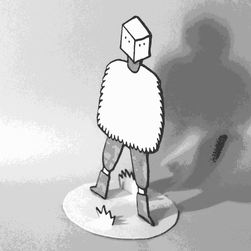
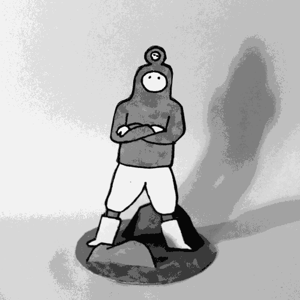

# Marionettes

## Marionettes en papier

Ce sont des figures en 2D qui peuvent être articulées.

Les techniques existantes similaires :

- [Poupées en papier (wikipedia)](https://fr.wikipedia.org/wiki/Poup%C3%A9e_en_papier)
- [Pantin / Jumping Jack (wikipedia)](https://fr.wikipedia.org/wiki/Poup%C3%A9e_en_papier)
- [Standee (wikipedia en)](https://en.wikipedia.org/wiki/Standee)
- [Animation en papier découpé (wikipedia)](https://fr.wikipedia.org/wiki/Animation_de_papiers_d%C3%A9coup%C3%A9s)

A priori ces marionettes seront manipulés à l'envers. Cette contrainte doit être utilisée à notre avantage :
- Un personnage articulé peut se tenir plus ou moins droit grace à la gravité tout en étant tenu par les pieds (pas de ficelle aparante contrairement à un pantin)
- Manipuler à l'envers par les pieds devrait permettre de créer une marche soignée sans se soucier du reste du corps.
- Des articulations souples au niveau des épaules peuvent donner des bras qui s'agitent en l'air : effet de peur ou de liesse.
- Des faux ballons d'helium en papier floteront dans les airs par eux-même.

Ces mario gagneront souvent à être recto-verso :
- Une mario de profile recto-verso peut faire volte-face pour regarder vers la gauche ou vers la droite
- Une mario recto-verso peut avoir des variation d'emotion ou autre entre ses deux faces.

## Esthetique

Dessin au feutre sur fond blanc avec des couleurs claires ou des nuances de gris, partir un peu de l'esthetique de ces figurines :

 

## Fabrication

Pour les articulation on est pas trop fan des ataches parisienne, on fait des proto avec des punaises et après on veut partir sur de la vis de ceinture (voir aussi écrou de reliure, rivet de reliure)

