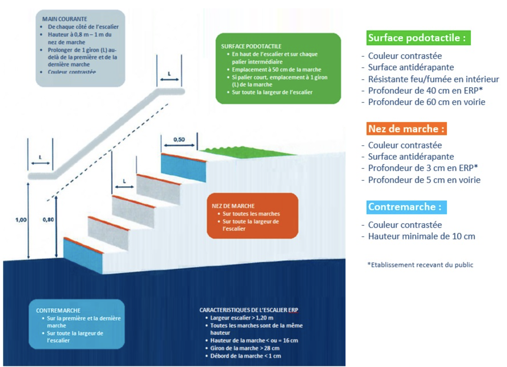

## Normes ERP CAT 5

En raison de leur plus faible effectif admissible, les ERP de 5e catégorie sont soumis à des règles de sécurité allégées par rapport aux autres catégories. Ils ont toutefois certaines règles à respecter comme : 

- Disposer d’au moins un extincteur par niveau (un appareil pour 300 m²) 
- Disposer d’issue(s) de secours dégagée(s)
- Disposer d’un système d’alerte audible dans tout l’établissement sur lequel le personnel est renseigné 
- Disposer d’un affichage des consignes de sécurité bien visible 
- Disposer d’une ligne de téléphone urbain pour joindre les secours (Demander une dérogation)
- Tenir un registre de sécurité à jour 

Pour les ERP de 5e catégorie recevant 19 personnes ou moins, ces règles sont allégées. 

Les ERP de 5e catégorie, comme tous les ERP, doivent également respecter les règles d’accessibilité. En effet, les ERP doivent être accessibles à toute personne handicapée, peu importe la nature du handicap. De plus, les ERP sont contrôlés par la commission consultative départementale de sécurité et d'accessibilité pour assurer le respect de ces règles.

## Contrôle réalisé par la commission de sécurité

> La commission consultative départementale de sécurité et d'accessibilité (CCDSA) effectue des visites de contrôle à la construction, à l'ouverture et au cours de l'exploitation de l'ERP: titleContent. Elle relève tous les manquements à la réglementation.
> 
> Les exploitants sont tenus d'assister à la visite de leur établissement ou de s'y faire représenter par une personne qualifiée. Le maire ou son représentant est également présent.
> 
> La commission contrôle tous les 3 ou 5 ans les ERP du 1er groupe (catégories 1,2,3 et 4) et les ERP de 5e catégorie avec locaux à sommeil (hôtel, pension de famille...).

## Escaliers

