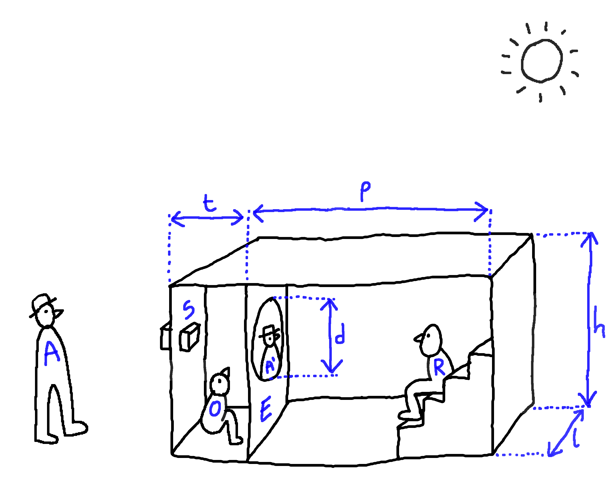

# Principe optique

## Le principe de la camera obscura

Le spectacle consiste à inviter le public à l'interieur d'une chambre noire géante. La chambre noire (camera obscura en latin) est le principe optique à la base du fonctionnement de l'œil, des cameras et des appareils photos. C'est le procédé par lequel une image apparait sur un écran, quand on se trouve dans milieu sombre avec une petite ouverture donnant sur un milieu lumineux.

## Découverte de la camera obscura

La chambre noire est un dispositif étonnement basique et simple à mettre en oeuvre. Dans sa forme la plus primitive c'est donc :

- un espace obscure (intérieur)
- un espace éclairé (extérieur)
- un trou entre les deux espaces

Réunir ces conditions suffit pour que la magie opère et qu'une image de l'extérieur soit projetée à l'intérieur.

Le dispositif est tellement simple qu'il peut apparaître par hasard. Avec un peu de chance est d'attention il est très probable qu'au cours de sa vie on rencontre plusieurs camera obscura naturelles. Comme en se réveillant tard dans une chambre à coucher plongée dans l'obscurité dont l'un des volets est percé, le soleil qui brille déjà fort à l'exterieur et on découvre au plafond l'image en couleur et en mouvement des passants dans la rue.

Frappé par la rencontre d'une camera obscura naturelle et motivé par l'envie de pouvoir revivre l'expérience à volonté, on peut avoir envie d'en fabriquer une artificielle. On découvrira alors qu'un très grand nombre de variables sont en jeu, toutes plus ou moins dépendante les unes des autres et déterminante pour la qualité de l'expérience.

## Complexité liés à la fabrication d'une camera obscura

Malgré la simplicité du principe de base décrit ci-dessus. Quand on veut construire une chambre noire avec une image grande, nette et lumineuse, on se heurte à plusieurs problèmes pratiques et limites théoriques dus au grand nombre de paramètres et à l'interdépendance de certains de ces paramètres.

Ce diagramme résume les liens entre nos besoins et les différentes variables d'ajustement :



Lien du diagramme (modifiable) : [tldraw](https://www.tldraw.com/r/PTp9ABojWfnR5E5pJ1Lpf?viewport=-3313,-959,5296,2475&page=page:Pfaj0dIyyjuVpmR7na4eN)

## Principe optique

 

A : Acteur	S : Système optique	O : Opérateur		E : Écran	R : Regardeur

t : tirage	p : profondeur		h : hauteur		l : largeur	d : diamètre de l’écran

## Premiers essais

Les premiers essais ont été réalisés avec un process lens Zeiss tessar 5,6/360 chiné sur ebay.

Les process Lens étaient construits à l'origine pour des dispositifs de reproduction d’image et sont aujourd’hui utilisés par des photographes qui font du grand et du très grand format. Avec cet objectif, nous sommes arrivé à projeter une image de 60 cm de diamètre. La netteté à l'infini est obtenue en plaçant l'écran à environ 40 cm de la lentille frontale. L'image est magnifique, relativement lumineuse et incroyablement définie. Bien entendu elle est inversée. Suite à ces premiers test, nous avons identifié plusieurs problèmes à résoudre.

