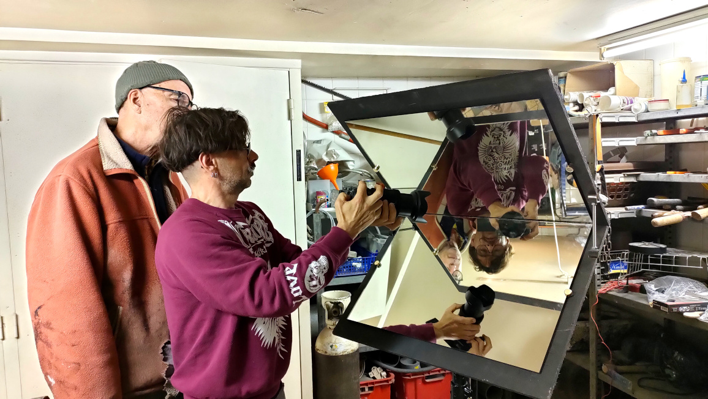

# Renversement de Renversement de l’image de l’imageimage

En utilisant un objectif ou une lentille simple, sur l’image projetée le haut et le bas sont inversés. Il faut réussir à retourner l’image pour rétablir son orientation haut-bas.

L’idéal serait d’éviter aussi une inversion droite-gauche mais ce n’est pas prioritaire.

## Tour d'horizon des solutions pour régler le problème du renversement

*Un prisme en toit d'Amici réalisé avec deux miroirs*

Plusieurs pistes envisagées :

### Retourner les spectateurs

Solution éliminée car c'est trop inconfortable voire dangereux d'être la tête en bas pendant 20 minutes.

### Équiper les spectateurs de lunettes retournant l'image

Cette solution, séduisante sur le papier, comporte quelques défauts : qualité médiocre, champ limité, gestion des lunettes pendant les séances, prix...

### Retourner comédiens et décors

Artistiquement très intéressante, cette option sera utilisée pour certaines séquences : ombres et animation, marionnettes à l'envers, comédiens suspendus.

### Retourner l'image

Pour retourner l'image plusieurs solutions ont étés envisagés :
- Les prismes (de Dove, de Poro-Abbe ou en toit d'Amici)
- Une solution sans prisme ni miroir par un agencement de lentille.
- Les agencements de mirroirs (avec 2, 3 ou 4 mirroirs, qui s'inspirent des prismes de Poro-Abbe ou en toit d'Amici)

L'option prisme a été abandonnée du fait de la taille excessive des prismes qu'il nous faudrait. Les essais sans prismes ni mirroirs (agencement de lentilles) n'ont pas été concluants.

La solution la plus simple que l’on ai trouvé est un dispositif à 2 miroirs inspiré du prisme en toit d’Amici.

#### Simulation

Voici une [simulation des solutions envisagées avec des miroirs](/contenu/simulation/mirrors/). Utilisez le clic gauche et la molette pour naviguer dans la scène. Utilisez la petite fenêtre en haut à droite pour sélectionner une scène et régler l'angle du champ de vision.

## Qualité des mirroirs

- Si nous devons utiliser des grands miroirs, comment limiter les défauts optiques observés lors des essais : perte de luminosité, double image, trait central dans le prisme en toit d'Amici... (miroir extra clair anti reflet, miroir first face..?)

## Le système à deux mirroirs en toit.

Pour concevoir ce dispositif, on est parti d'un agencement de deux mirroirs avec des tailles arbitraires. On a placé devant la FX3 en 4:3 avec un 35mm (ça correspond à un angle de champ de 45°) et on a tracé au feutre, sur les mirroir, les limites de la surface utile.

La forme ainsi obtenue est assez surprenante.

