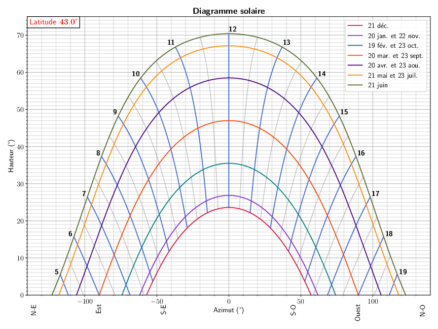
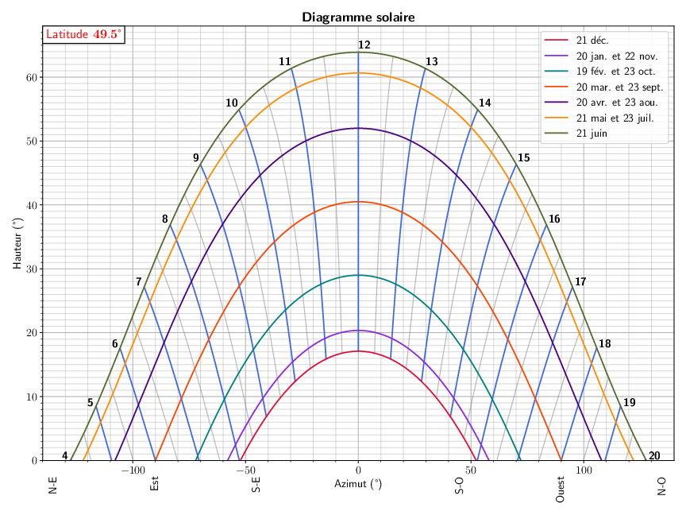

# La hauteur du soleil

La luminosité varie au cours de la journée et de l'année car le soleil fait que bouger.

Le facteur le plus important c'est la hauteur du soeil. Plus le soleil est haut dans le ciel, plus la luminosité est intense.

La hauteur du soleil se mesure en degrés. 90° Correspond à un soleil pile au dessus de ta tête. Un angle inférieur à 0° signifie que le soleil est de l'autre côté de la terre (c'est la nuit). 

Il existe des [outils en ligne pour connaître la hauteur du soleil](https://fr.planetcalc.com/4270/) à un endroit et à un moment donné. On peut donc comparer la luminosité théorique d'une séance dans le futur à celle d'une séance passée pour se rendre compte de ce que ça peut donner.

.

# Diagramme solaire azimut-hauteur

Position du soleil dans le ciel en fonction de la date et de l'heure
aux latitudes 43.0° (sud de la France) et 49.5° (nord de la France)

Les lignes horaires sont en heures solaire.

en heure d'été (avril à octobre) il l'heure légale est environ l'heure solaire + 2h. On souhaite jouer entre 11h et 16h donc sur le diagramme regarder entre 9h et 14h. On souhaite jouer de mars à avril donc regarder au-dessus de la ligne orange.

Source des diagrammes : David ALBERTO [www.astrolabe-science.fr](http://www.astrolabe-science.fr/diagramme-solaire-azimut-hauteur/)
